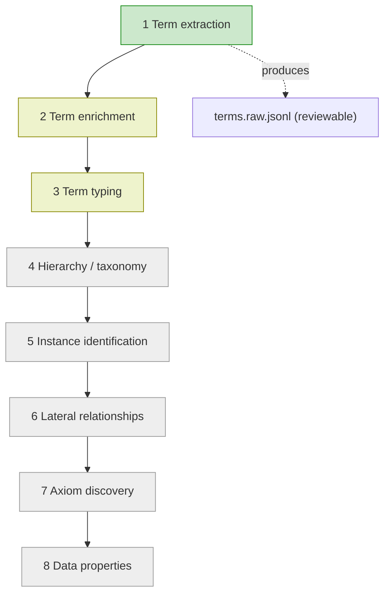

# Modularisation Recommendations

## In a nutshell

The ontology generator reads GOV.UK pages and turns them into a structured map of
concepts: an *ontology*, also called a *knowledge graph*. Today it does the whole
job in one big step. That makes it risky to change, because adjusting one thing
can break several others at once.

These recommendations are about splitting that one big step into smaller steps you
can improve and check one at a time, with a person reviewing each step. The data
science experiments tried exactly this and got better, more reviewable results
than the all-in-one approach. That is the case for doing the work.

Treat this as a map for the next team, not a delivery plan. It shows where the
safe boundaries are, what to protect, and where to start.

## Where to start

The heart of the work is recommendation 1: modularise the generator one step at a
time. Two moves inside it matter most. First, protect the shared files the repos
pass between each other, so a change cannot quietly break another team. Then take
the next step in the pipeline (term enrichment), guided by the Data Science Repo
and the IA (Information Architect) reviews. Keeping it safe is the job of the test
harness and the quality gates (recommendations 2 and 5); the rest is tooling and
model choices to pick up as they pay off.

## The repos involved

Five repositories touch this work. Each has one job.

| Area | Repository | What it does |
| --- | --- | --- |
| Workflow | [`alphagov/govuk-ai-accelerator`](https://github.com/alphagov/govuk-ai-accelerator) | The web app: ingests pages, runs jobs, tracks them, and lets you browse and compare outputs. |
| Generator | [`alphagov/govuk-ai-accelerator-tw-accelerator`](https://github.com/alphagov/govuk-ai-accelerator-tw-accelerator) | The engine (`taxonomy-ontology-accelerator`): turns page content into the ontology. |
| Ontology Validator | [`alphagov/govuk-ai-accelerator-generator-e2e-testing-framework`](https://github.com/alphagov/govuk-ai-accelerator-generator-e2e-testing-framework) | The rule checker for the generated ontology file (`ontology.ttl`, written in the Turtle text format): naming, spelling, and golden-schema checks. The team also calls this the test harness. |
| Data Science Repo | [`alphagov/govuk-ai-accelerator-tooling`](https://github.com/alphagov/govuk-ai-accelerator-tooling) | The research bench: experiments, ground-truth data, and tools to compare outputs. |
| Content Workflow | [`alphagov/govuk-ai-graph-tools`](https://github.com/alphagov/govuk-ai-graph-tools) | The downstream tool: turns the graph into views and spots duplicates and outliers. |

For the full technical picture, including a lifecycle diagram and a change-impact
guide, see the cross-repo integration document,
[`docs/architecture/cross-repo-integration.md`](docs/architecture/cross-repo-integration.md).
This document only summarises it.

## How a run works today

A normal run flows like this:

1. [Workflow](https://github.com/alphagov/govuk-ai-accelerator) takes a list of GOV.UK URLs, cleans the content, and stores it.
2. Workflow queues a generation job.
3. Workflow calls the [Generator](https://github.com/alphagov/govuk-ai-accelerator-tw-accelerator), which it installs as a Python package.
4. The Generator produces files: `schema.json`, `graph.json`, `ontology.ttl`, metrics, logs, and config.
5. Workflow shows the job status and lets you download and compare runs.
6. The [Ontology Validator](https://github.com/alphagov/govuk-ai-accelerator-generator-e2e-testing-framework) can check the `ontology.ttl`.
7. [Content Workflow](https://github.com/alphagov/govuk-ai-graph-tools) turns `graph.json` into graph and outlier views.
8. The [Data Science Repo](https://github.com/alphagov/govuk-ai-accelerator-tooling) provides the experiments and ground truth to compare against.

The point to take away: this is not just an internal tidy-up of one codebase. The
shared files travel between several repos, so a change in the Generator can reach
all of them.

Under the bonnet, the Generator does every step from two prompts: a default prompt
with the instructions, and a domain prompt that adds subject knowledge. For a
large set of pages it splits the text into smaller pieces it can handle (called
chunks), runs them through the model in parallel, then merges the overlapping
results by matching them on meaning (*semantic matching*). It uses one model to
generate and another to match, and both can be swapped. (Today those are Claude
Sonnet 4.6 and Cohere Embed V3 multilingual, both on Amazon Bedrock.)

## The pipeline inside the generator

The Generator builds the ontology in a sequence of steps. Today they run as one
block; the recommendations are about splitting them up so each can be improved on
its own. Only the first step is built so far.

- **Green** is built: term extraction runs today.
- **Yellow** was tested in the experiments (enrichment and typing), so there is
  ground truth to compare a new version against.
- **Grey** has no experiments yet; isolating these will mean building fresh ground
  truth first.

Following a single word through the steps: *"passport"* is pulled out by **term
extraction**, grouped with "travel document" by **enrichment**, labelled a
`Document` by **typing**, slotted under broader classes by **hierarchy**, then
linked to related terms by the **relationship** steps.

## The shared files that must not break

These files pass between repos, so treat them as contracts: their names, shapes,
and meanings are promises other teams rely on.

| File | Made by | Used by | Why it matters |
| --- | --- | --- | --- |
| `schema.json` | Generator | Workflow, reviewers, analysis tools | Defines the entity and relationship types. |
| `graph.json` | Generator | Workflow, Content Workflow | The main graph. Content Workflow depends on its entities, aliases, source files, and relationships. |
| `ontology.ttl` | Generator | Ontology Validator, Workflow harness, reviewers | The main ontology file (in the RDF/OWL standards), used for automated checks. |
| `owl_ontology_metrics.csv` | Generator and Workflow harness | Workflow history and deployment review | Flags regressions as you modularise. |
| `regression_report.json` | Workflow harness | Deployment and review | Records how a run compares to the accepted baseline. |
| `terms.raw.jsonl` | Built term-extraction stage | Generator continuation, reviewers, Data Science Repo | The reviewable output of term extraction. |
| `graphNode.json` | Content Workflow | Content Workflow frontend | A view built downstream, separate from the Generator's `graph.json`. |

## Recommendations

### 1. Modularise the generator, step by step

*Split the work so that when something breaks, you know which step did it.*

The generator is where almost all the work happens, and where one change ripples
everywhere: alter a single prompt and the schema, the graph, the Turtle file, and
the views built on them can all shift at once. The other repos each have one clear
job; the generator is the tangled one, so it is the place to focus. Do not rewrite
it in one go. Take one step (see the pipeline diagram above), write down exactly
what goes in and what comes out, compare it against the current behaviour, and only
then move on. That turns "something broke somewhere" into "this step broke", which
is the difference between a fix that takes an afternoon and one that takes a week.

Before you change anything, lock down the shared files the generator produces.
Write down and test the contract for each one, its name, shape, and meaning, so a
change cannot silently break another team downstream.

With the contracts in place, the question is which step to take, and one is already
done: term extraction is built. It runs as a step configured through `config.yaml`
and switched on by a feature flag, and produces `terms.raw.jsonl` for review. Let
the evidence decide the next one, not just the default order. The Data Science
Repo's ground truth shows which step can be measured cleanly, and the IA reviews
show whether the last step's output is good enough to build on. The default order
puts term enrichment next, and the earliest steps are the ones with evidence to
compare against: enrichment and typing were tested, while the later steps need
fresh ground truth first. Even so, take the step the evidence actually points to.

For each step, be clear about three things: what goes in, what comes out, and how
you will measure quality. Run the new version on the same pages as before and put
it through every quality gate in recommendation 5, not just the generator's own
tests. Add a person reviewing the result, because the experiments found that human
review is what makes the step-by-step approach hold up.

Put each new step behind its own feature flag, the way term extraction already is,
and turn them on one at a time so you can roll a step out or back without
disturbing the others. Keep the old and new versions side by side behind that flag
just long enough to trust the new one, then delete the old path, otherwise the
flags pile up into a maintenance headache.

*Example: when you split out the "typing" step, run it on the same pages as
before. If a passport used to come out as a `Document` and now comes out as a
`Person`, the step-by-step setup tells you straight away which step to look at.*

### 2. Evolve the Ontology Validator (a.k.a. Test Harness) alongside the generator

*The safety checks only protect you if they keep up with the generator as it
changes.*

Recommendation 5 runs the Ontology Validator as one of its gates, and the Workflow
harness separately checks each run against an accepted baseline. This is the other
half: those checks only hold up while they keep pace with the Generator. As each
step is modularised, what the Generator produces shifts, and a frozen set of checks
fails in one of two ways.

It goes blind, letting a new kind of error through because no rule covers the new
step's output. Or it cries wolf, tripping on output that is legitimately different,
until the team starts ignoring failures and switching checks off, which is worse
than having no checks at all.

So treat the rules, the golden references, and the accepted baseline as code that
ships with each Generator change, not a fixed backstop. When a step changes what
`ontology.ttl` looks like or means, update the rules in the same change. When the
output legitimately changes, set a new golden reference or baseline on purpose and
record why, so it is a reviewed decision and not a silent overwrite. Read every
failure as a question: did the Generator get worse, or has the check fallen behind?
Grow the checks as each step is isolated (a new typing step arrives with typing
checks of its own), and version them alongside the shared-file contracts in
recommendation 1.

### 3. Build human-in-the-loop tooling for the intermediate outputs

*Turn the pipeline from a black box into something a person can see into, correct,
and compare, step by step.*

The steps in between (extracted terms, enriched clusters, types) are just files
today, not something a reviewer can easily read, fix, or compare. Three pieces of
tooling would let an Information Architect steer the pipeline:

- **Resume from any step.** A run is all-or-nothing today: if step 5 goes wrong,
  you start again at step 1. If each step saves its output in a form you can load
  back in, you can pick up from any point instead of the top. This builds on the
  stable intermediate files in recommendation 1.
- **A screen to review and correct each step's output.** A simple view that shows
  each step's output and lets a reviewer fix it. Combined with resuming, an edit
  can pick up from that step onward instead of restarting the whole run.
- **A/B-compare two runs, step by step.** When you change a step, the fastest way
  to judge it is to put the new run next to the old one, with differences
  highlighted at the terms, the types, and the final ontology. It turns "is this
  better?" into something you can answer by looking, and gives the Data Science
  Repo and the IAs a shared place to make the same call as the quality gates in
  recommendation 5.

### 4. Automate setting the harness baseline

*Make accepting a new "known-good" run a deliberate button, not a manual file
edit.*

The harness compares each run against an accepted baseline. Today, promoting a new
baseline means editing files by hand, which is easy to get wrong and hard to audit.
A small automation (review the candidate, then promote it with one action that
records who, when, and why) makes baseline changes deliberate and traceable. This
supports recommendation 2, where moving the baseline on purpose is the whole point.

### 5. Use the surrounding repos as quality gates

*Each surrounding repo catches a different kind of problem; run them all before
you ship a change.*

Each surrounding repo guards a different kind of quality. Run all three before
accepting a change.

**The Ontology Validator, for the Turtle file.** Leave it doing what it does well:
checking the generated Turtle for naming, spelling, and golden-schema rules. Being
small and focused is a strength, not a gap. For now, run it on candidate
`ontology.ttl` files whenever a Generator step changes, and treat a failure as a
prompt to investigate, not automatic proof that something is broken. Its job can
grow later (see recommendation 2).

**Content Workflow, for whether the graph is still useful.** After a meaningful
change, run real `graph.json` outputs through it. A change can keep the JSON
perfectly valid while making the graph far less useful to explore, and the only
way to catch that is to run it. Check that `graphNode.json` still builds and that
aliases and source files still link back to the right GOV.UK content.

**The Data Science Repo, for whether the meaning is right.** Structural checks are
not enough to tell you an ontology is good. Things like term completeness, false
positives, and whether the terms are genuinely useful need comparison against
ground truth and human judgement, and that evidence lives here. Reuse its method:
hand-model a small slice of the content as ground truth, small enough that the
model can read it all at once so it does not need splitting up, then measure output
against it. Record which prompt and model produced each comparison, because both
can be swapped and that record is the only thing that keeps the numbers repeatable.

### 6. Stay open to newer, more capable models

*A better model can lift every step at once, so re-check the model choice as the
field moves.*

The generator's models are configurable: one model generates, another matches, and
recommendation 5 already records which. Because that same pair feeds every step,
one upgrade, evaluated once, can raise the whole pipeline for the cost of a single
re-evaluation. At the time of writing, Claude Sonnet 5 had just been released,
while the generator still runs on Sonnet 4.6. When a stronger model ships, run it
against the same ground truth and the same checks (recommendations 2 and 5) before
adopting it. Treat a model upgrade like any other change: evidence first, then make
it the default.
