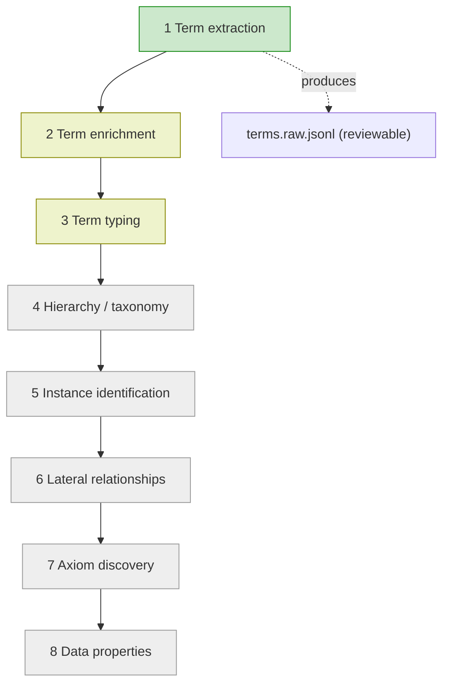

# Recommendations for splitting up the generator

## In a nutshell

The generator reads GOV.UK pages and builds a map of the main terms and how they
relate to each other. That map is the ontology, also called the knowledge graph.

At the moment it does too much in one go. One small prompt or code change can
alter the schema, graph, ontology file, and the views built from them all at
once.

The recommendation is to split the generator into smaller steps. Each step should
be easy to test, review, and improve on its own. The Data Science Repo tried this
approach and found the outputs easier to review than the current all-in-one run.

This is not a delivery plan. It is a handover note for the next team: what to
protect, where to start, and what to check before changing the generator.

## The repos involved

Five repositories touch this work. Each has a specific job.

| Area | Repository | What it does |
| --- | --- | --- |
| Workflow | [`alphagov/govuk-ai-accelerator`](https://github.com/alphagov/govuk-ai-accelerator) | The web app. It ingests pages, runs jobs, tracks them, and lets users browse and compare outputs. |
| Generator | [`alphagov/govuk-ai-accelerator-tw-accelerator`](https://github.com/alphagov/govuk-ai-accelerator-tw-accelerator) | The engine. It turns page content into the ontology. |
| Ontology Validator | [`alphagov/govuk-ai-accelerator-generator-e2e-testing-framework`](https://github.com/alphagov/govuk-ai-accelerator-generator-e2e-testing-framework) | Checks the final ontology file for naming, spelling, and expected structure. The team also calls this the test harness. |
| Data Science Repo | [`alphagov/govuk-ai-accelerator-tooling`](https://github.com/alphagov/govuk-ai-accelerator-tooling) | Experiments, reference examples, and tools to compare outputs. |
| Content Workflow | [`alphagov/govuk-ai-graph-tools`](https://github.com/alphagov/govuk-ai-graph-tools) | Turns the graph into views and spots duplicates and outliers. |

For the full technical picture, see
[`docs/architecture/cross-repo-integration.md`](docs/architecture/cross-repo-integration.md).
This file is the shorter recommendations version.

## How a run works today

A normal run works like this:

1. [Workflow](https://github.com/alphagov/govuk-ai-accelerator) takes a list of GOV.UK URLs, cleans the content, and stores it.
2. Workflow queues a generation job.
3. Workflow calls the [Generator](https://github.com/alphagov/govuk-ai-accelerator-tw-accelerator), which it installs as a Python package.
4. The Generator writes `schema.json`, `graph.json`, `ontology.ttl`, metrics, logs, and config.
5. Workflow shows the job status and lets users download and compare runs.
6. The [Ontology Validator](https://github.com/alphagov/govuk-ai-accelerator-generator-e2e-testing-framework) can check `ontology.ttl`.
7. [Content Workflow](https://github.com/alphagov/govuk-ai-graph-tools) turns `graph.json` into graph and outlier views.
8. The [Data Science Repo](https://github.com/alphagov/govuk-ai-accelerator-tooling) provides experiments and reference examples to compare against.

The important point is that the files move between repos. A change in the
Generator can affect the Workflow, the validator, the Data Science Repo, and
Content Workflow.

Inside the Generator, two prompts tell the model what to do: one general prompt
and one prompt with subject-specific context. For large page sets, the Generator
splits the text into chunks, runs them through the model, then joins results that
mean the same thing. Today it uses Claude Sonnet 4.6 for generation and Cohere
Embed V3 multilingual for matching, both on Amazon Bedrock.

## Split graph building into clear stages

Think of the generator as a set of stages. Today most of those stages run as one
block. The aim is to separate them so each stage can be checked before the next
one starts. Only the first stage is built so far.

- **Green** is built: term extraction runs today.
- **Yellow** has been tested in experiments, so there is something to compare
  against.
- **Grey** has not been tested yet. Those stages will need fresh examples before
  they can be judged properly.

For example, "passport" is found by **term extraction**, grouped with "travel
document" by **enrichment**, labelled as a `Document` by **typing**, put under
broader classes by **hierarchy**, then linked to related terms by the
**relationship** stages.

## Files other tools rely on

These files are used outside the Generator. If their names, structure, or meaning
change without warning, another repo can break.

| File | Made by | Used by | Why it matters |
| --- | --- | --- | --- |
| `schema.json` | Generator | Workflow, reviewers, analysis tools | Lists the types of things and relationships in the graph. |
| `graph.json` | Generator | Workflow, Content Workflow | The main graph used by the app and other tools. |
| `ontology.ttl` | Generator | Ontology Validator, Workflow harness, reviewers | The final ontology file used for automated checks. |
| `owl_ontology_metrics.csv` | Generator and Workflow harness | Workflow history and deployment review | Shows whether a run has got better or worse. |
| `regression_report.json` | Workflow harness | Deployment and review | Compares a new run with the accepted baseline. |
| `terms.raw.jsonl` | Built term-extraction stage | Generator continuation, reviewers, Data Science Repo | The terms found in the first stage, ready for review. |
| `graphNode.json` | Content Workflow | Content Workflow frontend | A view built from the graph. |

## Recommendations

### 1. Split up the generator one step at a time

*Split the work so that when something breaks, you know which step did it.*

The generator is the complicated part. The other repos have clearer jobs. One
generator change can affect the schema, graph, ontology file, metrics, and views
built from the graph.

Do not rewrite it in one go. Take one stage at a time. For each stage, write down
what goes in, what comes out, and how the new output compares with the current
one. That turns "something broke somewhere" into "this stage changed the output".

Before changing the stages, protect the files other repos use. For each file,
document and test its name, structure, and meaning. A change should not silently
break another repo.

Term extraction is already split out. It is configured through `config.yaml`, can
be turned on or off with a feature flag, and writes `terms.raw.jsonl` for review.

The next stage should be chosen using evidence, not just the order in the
diagram. Term enrichment is a good candidate because the Data Science Repo has
examples to compare against for enrichment and typing. The later stages need new
examples first. IA review should also decide whether the previous stage is good
enough to build on.

For each new step, be clear about three things:

1. what goes in;
2. what comes out;
3. how quality will be measured.

Run the new stage on the same pages as the current version and use the quality
signals in recommendation 5, not only the generator's own tests. Keep a person
reviewing the output. The experiments showed that this is what makes the
step-by-step approach useful.

Put each stage behind its own feature flag, as term extraction already is. Turn
stages on one at a time so they can be rolled out or rolled back without changing
the rest of the process. Keep the old and new paths side by side only long enough
to trust the new one, then remove the old path.

Example: when the typing step is split out, run it on the same pages as before.
If `passport` used to be typed as a `Document` and now comes out as a `Person`,
the split setup shows where to look.

### 2. Keep the validator in sync with the generator

*The checks only protect us if they keep up with the generator.*

The Ontology Validator checks the final ontology file. The Workflow harness also
compares each run with an accepted baseline. These checks need to change when the
generator changes.

If the checks stand still while the generator changes, two things can happen.
They can miss new errors because no rule covers the new output. Or they can fail
on output that is different for a good reason, until the team starts ignoring the
checks.

Treat the rules and accepted baseline as part of each generator change. When a
stage changes what `ontology.ttl` looks like or means, update the checks in the
same change. When the output changes on purpose, approve a new baseline and
record why.

Read every failure as a question: did the generator get worse, or does the check
need updating? As each stage is split out, add checks for it. A new typing stage
should come with typing checks of its own.

### 3. Give reviewers a way to check each stage

*Make the process something a person can inspect, correct, and compare.*

The outputs from each stage, such as extracted terms, grouped terms, and types,
are just files today. They are not easy for an IA to read, fix, or compare.

Three small tools would make the process easier to steer:

- **Resume from any step.** A run is all-or-nothing today. If step 5 goes wrong,
  you start again at step 1. If each step saves an output that can be loaded back
  in, the team can restart from that point instead of rerunning everything.
- **Review and correct each step's output.** Add a simple screen for each step
  where a reviewer can make corrections. With resume support, the run can then
  continue from the corrected step.
- **Compare two runs side by side.** When a stage changes, put the new run next
  to the old one and highlight differences at the term, type, and final ontology
  levels. This gives the Data Science Repo and IAs a shared way to make the same
  judgement as the quality signals in recommendation 5.

### 4. Make it easy to approve a new baseline

*Make accepting a new known-good run a deliberate action, not a manual file edit.*

The harness compares each run with an accepted previous run, called the baseline.
Today, promoting a new baseline means editing files by hand. That is easy to get
wrong and hard to audit.

Add a small promotion flow: review the candidate run, promote it with one action,
and record who promoted it, when, and why. This supports recommendation 2, where
changing the baseline deliberately is the important bit.

### 5. Use the other repos to assess quality

*The other repos give different views of whether the generator output is good.*

The generator's own tests are not enough to tell whether the output is useful.
The other repos can help assess quality from different angles: whether the final
ontology file is valid, and whether the graph still works for content tooling.

**The Ontology Validator, for the final ontology file.** Use it to check naming,
spelling, and structure in `ontology.ttl`. A failure is a prompt to investigate:
the generator may be wrong, or the validator may need updating.

**Content Workflow, for whether the graph is still useful.** Run real
`graph.json` outputs through it when you need to understand the effect of a
change. A graph can be valid JSON and still be much less useful to explore. Check
that `graphNode.json` still builds, and that aliases and source files still link
back to the right GOV.UK content.

### 6. Stay open to newer, more capable models

*A better model can improve every step, but it still needs to earn its place.*

The generator's models are configurable. One model creates the ontology content
and another matches similar terms. Because the same model choices feed every
stage, one well-tested upgrade can improve the whole process.

At the time of writing, the generator uses Claude Sonnet 4.6 and Claude Sonnet 5
has just been released. Treat a model upgrade like any other generator change:
run it against the same reference examples and the same checks in recommendations
2 and 5 before making it the default. Evidence first, then switch.
