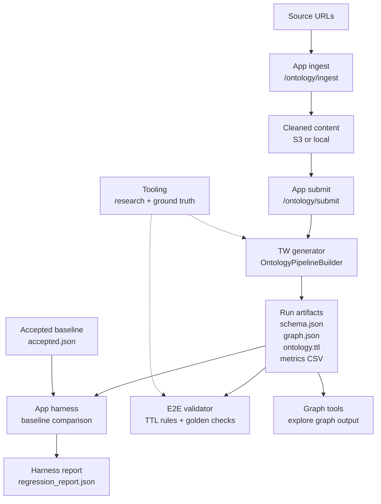

# Ontology Generation Cross-Repo Integration

This technical overview explains how the Generator, Workflow, and E2E Testing
Framework connect across the GOV.UK AI ontology repositories. It is intended for
handover: a new team should be able to see which repository owns each part of
the lifecycle, which runtime dependencies are involved, and which artifacts move
between stages.

## Repositories

| Repository | Responsibility |
| --- | --- |
| [alphagov/govuk-ai-accelerator](https://github.com/alphagov/govuk-ai-accelerator) | Web app, ingestion workflow, ontology job orchestration, job tracking, artifact browsing, and ontology harness baseline comparison. |
| [alphagov/govuk-ai-accelerator-tw-accelerator](https://github.com/alphagov/govuk-ai-accelerator-tw-accelerator) | Ontology generator library. It reads domain inputs/configuration, runs the ontology pipeline, and writes schema, graph, and OWL/RDF artifacts. |
| [alphagov/govuk-ai-accelerator-generator-e2e-testing-framework](https://github.com/alphagov/govuk-ai-accelerator-generator-e2e-testing-framework) | Rule-based validator for generated Turtle (`.ttl`) ontology files, including naming/spelling checks and optional golden-schema comparison. |
| [alphagov/govuk-ai-accelerator-tooling](https://github.com/alphagov/govuk-ai-accelerator-tooling) | Research and analysis notebooks, ground-truth ontology files, term extraction experiments, Bedrock exploration, and matching utilities. |
| [alphagov/govuk-ai-graph-tools](https://github.com/alphagov/govuk-ai-graph-tools) | Downstream proof-of-concept graph and content-quality tooling that consumes ontology/knowledge-graph output for duplicate, outlier, and graph exploration workflows. |

## Lifecycle



The research tooling informs prompts, baselines, ground-truth checks, and
validation expectations, but it is not part of the production run path.

## Runtime And Support Paths

The production runtime path is the app plus the generator library:
`govuk-ai-accelerator` ingests content, accepts ontology jobs, stores job state,
and invokes `govuk-ai-accelerator-tw-accelerator` to produce ontology artifacts.

The supporting repositories sit around that path:

- `govuk-ai-accelerator-generator-e2e-testing-framework` checks generated
  `ontology.ttl` files against agreed validation rules.
- `govuk-ai-accelerator-tooling` contains the notebooks, ground-truth files, and
  experiments that informed prompts, baselines, and validation expectations.
- `govuk-ai-graph-tools` consumes generated graph output for downstream graph,
  duplicate, and outlier exploration.

## Integration Contracts

These files are the main contracts between repositories. Treat their names,
formats, and meanings as cross-repo dependencies.

| Artifact | Produced by | Consumed by | Contract |
| --- | --- | --- | --- |
| `ontology.ttl` | Generator library via the app | Harness, E2E validator, reviewers | OWL/RDF Turtle export for the generated ontology. |
| `schema.json` | Generator library via the app | App UI, reviewers, downstream tooling | Entity and relationship type definitions. |
| `graph.json` | Generator library via the app | App UI, graph tools, reviewers | Generated ontology/knowledge graph structure. |
| `owl_ontology_metrics.csv` | Generator and harness workflows | App historical jobs view, deployment review | Run metrics, with harness result columns when the harness has run. |
| `regression_report.json` | `govuk-ai-accelerator` harness | Deployment/review workflow | Baseline comparison report for the candidate run. |
| `baselines/accepted.json` | Maintained baseline manifest | Harness | Pointer to the immutable accepted baseline run. |

## Version Coupling

The app orchestrates the generator, but generator changes can alter the artifact
shape, ontology terms, metrics, and validation results. A generator update can
therefore affect the app UI, harness baseline, E2E validator expectations, and
graph-tool consumers.

When promoting or deploying generator changes, check whether the accepted
baseline, validator fixtures, and graph-tool assumptions still match the new
outputs.

## Stage Responsibilities

### 1. Ingestion

Owned by `govuk-ai-accelerator`.

The ingestion workflow starts from a list of GOV.UK URLs and produces cleaned
content files for a domain. The app exposes `POST /ontology/ingest`; the
underlying scripts can also be run locally. Ingestion supports local or S3
storage through `fsspec` and writes timestamped logs for auditing.

Primary artifacts:

- raw downloaded HTML;
- extracted and cleaned markdown/text content;
- ingestion logs;
- domain input folders suitable for the ontology generator.

### 2. Generator Execution

Orchestrated by `govuk-ai-accelerator`, implemented by
`govuk-ai-accelerator-tw-accelerator`.

The app accepts ontology jobs through `POST /ontology/submit`, tracks job state
in PostgreSQL, and runs the generator package in a background task. The
generator uses `OntologyPipelineBuilder` to set up the pipeline, extract
ontology data, deduplicate, build relationships, update the schema, validate,
save, and export the ontology.

Primary artifacts:

- `schema.json`: entity and relationship type definitions;
- `graph.json`: generated ontology graph;
- `ontology.ttl`: OWL/RDF Turtle export used by validators and harness checks;
- `config.yaml`: persisted run configuration;
- logs and run metadata;
- `owl_ontology_metrics.csv` where enabled by the generator workflow.

### 3. Harness Comparison

Owned by `govuk-ai-accelerator`.

The ontology harness is a post-deployment baseline check. When enabled, it runs
the normal generator against a dedicated harness domain, reads an accepted
baseline manifest, compares baseline and candidate `ontology.ttl` metrics, and
writes a regression report.

Harness configuration:

- `ONTOLOGY_HARNESS_ENABLED`: turns the scheduled harness on. If it is unset or
  false-like, the app starts without queueing a harness job.
- `ONTOLOGY_HARNESS_DEPLOYMENT_ID`: identifies the deployment or generator
  revision being checked. This is required when the harness is enabled because
  it becomes part of the one-job-per-deployment key.
- `ONTOLOGY_HARNESS_DOMAIN`: optional domain/folder name for the harness input
  and output. Defaults to `ontology-harness-baseline`.
- `ONTOLOGY_HARNESS_CONFIG_URI`: optional config file location. Defaults to
  `s3://<bucket>/<domain>/config.yaml`.
- `ONTOLOGY_HARNESS_BASELINE_MANIFEST_URI`: optional accepted-baseline manifest
  location. Defaults to `s3://<bucket>/<domain>/baselines/accepted.json`.
- `baselines/accepted.json`: the manifest the harness reads to find the
  immutable baseline run to compare against.

Only `ONTOLOGY_HARNESS_ENABLED=true` and `ONTOLOGY_HARNESS_DEPLOYMENT_ID` are
needed to schedule the harness with the default S3/domain layout. The other
settings are overrides for non-default locations. If the post-deployment harness
is not being run, none of these variables are needed.

Primary artifacts:

- candidate run output folder;
- `regression_report.json`;
- harness summary columns added to `owl_ontology_metrics.csv`.

### 4. E2E Validation

Owned by `govuk-ai-accelerator-generator-e2e-testing-framework`.

The E2E testing framework validates generated `ontology.ttl` files. The workflow
is validation/testing rather than LLM scoring. It checks naming conventions,
US-English spelling conventions, and optional golden-schema comparison.

Primary inputs:

- generated `ontology.ttl`;
- optional golden/reference `.ttl`;
- optional `.allowlist` for intentional domain terms.

Primary artifacts:

- command-line pass/fail output;
- JSON output when requested;
- numbered violation report folders containing a copy of the checked `.ttl` and
  `violations.txt`.

### 5. Research, Ground Truth, and Analysis Tooling

Owned by `govuk-ai-accelerator-tooling`.

This repository contains experimental notebooks and helper utilities used during
the ontology work. It is not the production workflow, but it helps explain how
ground-truth ontologies, extraction experiments, Bedrock exploration, and
matching approaches informed generator and validation expectations.

Primary artifacts:

- ground-truth `.ttl` and `.rdf` files;
- notebooks for term extraction and enrichment experiments;
- matching utilities for direct, fuzzy, and semantic matching;
- Bedrock model exploration outputs.

### 6. Graph and Outlier Exploration

Owned by `govuk-ai-graph-tools`.

Graph tools consume ontology/knowledge-graph output downstream. The tool turns a
knowledge graph into browsable graph views and content-quality signals, including
semantic duplicate and outlier workflows.

Primary inputs:

- generated knowledge graph JSON;
- S3 source markdown/documents;
- optional OpenSearch index for retrieval.

Primary artifacts:

- graph view model output such as `graphNode.json`;
- visual graph views;
- duplicate and outlier analysis outputs.

## Runtime Dependencies

| Area | Main dependencies |
| --- | --- |
| App and workflow | Python 3.13, `uv`, Flask, Waitress, PostgreSQL, SQLAlchemy, AWS credentials, S3, `fsspec`. |
| Generator library | `taxonomy-ontology-accelerator`, LLM provider configuration, AWS Bedrock where configured, S3 or local filesystem storage. |
| Harness | Same generator dependencies plus baseline manifest and S3 access to baseline/candidate `ontology.ttl` files. |
| E2E validator | Python, `uv`, `rdflib`, OWL-RL inference, rule modules, optional golden `.ttl`. |
| Tooling | Python notebooks, Bedrock access for experiments, ontology files, matching libraries such as sentence-transformers/rapidfuzz where used. |
| Graph tools | Python 3.12, Flask/Uvicorn, AWS Bedrock, Amazon OpenSearch, S3, Cytoscape.js, Pydantic, `uv`. |

## Artifact Flow

| Stage | Input | Output | Next consumer |
| --- | --- | --- | --- |
| Ingestion | GOV.UK URLs or source list | Cleaned markdown/text, logs | Generator execution |
| Generator execution | Domain config, prompt, cleaned input content | `schema.json`, `graph.json`, `ontology.ttl`, metrics/logs | Harness, E2E validator, graph tools, review UI |
| Harness comparison | Candidate `ontology.ttl`, accepted baseline manifest | `regression_report.json`, harness CSV columns | Deployment/review workflow |
| E2E validation | Generated `ontology.ttl`, optional golden `.ttl` | Pass/fail result, optional JSON, violation reports | Generator maintainers and handover reviewers |
| Graph tools | Knowledge graph JSON and source documents | Graph visualisations, duplicate/outlier reports | Content quality review |
| Tooling | Ground truth, generated runs, experiment data | Matching results, notebooks, prompts/analysis | Generator and validation design decisions |

## Change Impact Guide

| Change | Check these repositories |
| --- | --- |
| Change `ontology.ttl` structure or naming conventions | `govuk-ai-accelerator`, `govuk-ai-accelerator-generator-e2e-testing-framework`, `govuk-ai-graph-tools`. |
| Change `schema.json` or `graph.json` shape | `govuk-ai-accelerator`, `govuk-ai-graph-tools`, any notebooks in `govuk-ai-accelerator-tooling` that read generated output. |
| Change generator prompts, models, or extraction logic | Harness baseline, E2E validator fixtures, ground-truth assumptions in `govuk-ai-accelerator-tooling`. |
| Change harness metrics or report fields | `govuk-ai-accelerator` historical jobs view, deployment review process, `owl_ontology_metrics.csv` consumers. |
| Promote a new accepted baseline | `baselines/accepted.json`, harness run history, any handover notes explaining why the baseline changed. |

## Where To Start When Debugging

| Symptom | Start here |
| --- | --- |
| Source URLs did not produce usable files | `govuk-ai-accelerator` ingestion route and `scripts/ingestion/README.md`. |
| Ontology job failed or stopped | `govuk-ai-accelerator` job status, logs, and `scripts/pipeline/ontology_generator.py`. |
| Generated output looks structurally wrong | `govuk-ai-accelerator-tw-accelerator` ontology engine docs and run book. |
| Harness failed after deployment | `govuk-ai-accelerator` harness docs and `scripts/pipeline/ontology_harness.py`. |
| `ontology.ttl` violates naming/spelling/golden expectations | `govuk-ai-accelerator-generator-e2e-testing-framework` run book and validator reports. |
| Graph/outlier UI output is missing or surprising | `govuk-ai-graph-tools` README and generated graph artifacts. |
| You need historical experiment context | `govuk-ai-accelerator-tooling` notebooks, ground truth data, and matching utilities. |

## Confluence Run Books Index

The Confluence run books index should link to this GitHub page rather than
copying its contents:

```text
https://github.com/alphagov/govuk-ai-accelerator/blob/main/docs/architecture/cross-repo-integration.md
```
