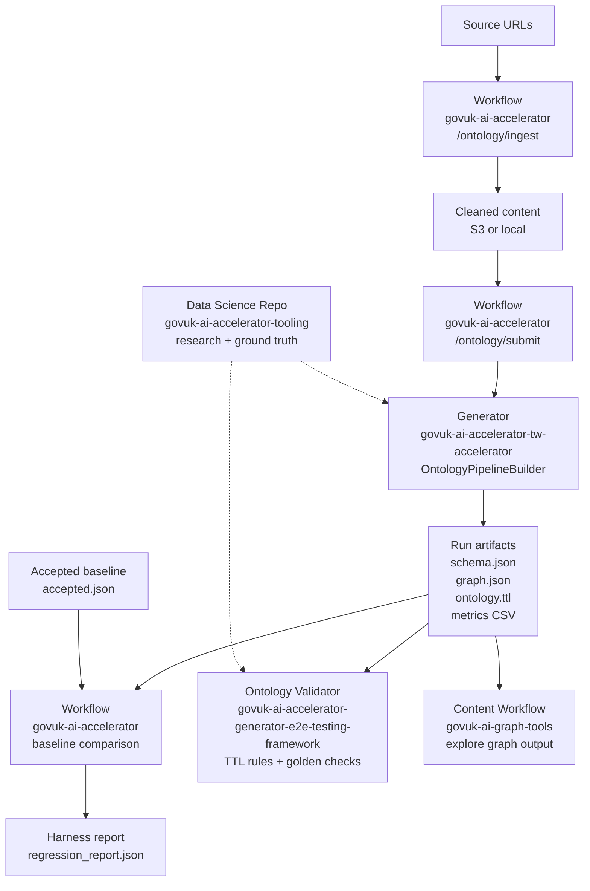

# Ontology Generation Cross-Repo Integration

This technical overview explains how the Workflow, Generator, Ontology
Validator, Data Science Repo, and Content Workflow connect across the GOV.UK AI
ontology repositories. It is intended for handover: a new team should be able to
see which repository owns each part of the lifecycle, which runtime dependencies
are involved, and which artifacts move between stages.

## Repositories

| Name used here | Repository | Responsibility |
| --- | --- | --- |
| Workflow | [alphagov/govuk-ai-accelerator](https://github.com/alphagov/govuk-ai-accelerator) | Web app, ingestion workflow, ontology job orchestration, job tracking, artifact browsing, and ontology harness baseline comparison. |
| Generator | [alphagov/govuk-ai-accelerator-tw-accelerator](https://github.com/alphagov/govuk-ai-accelerator-tw-accelerator) | Generator library. It reads domain inputs/configuration, runs the ontology pipeline, and writes schema, graph, and OWL/RDF artifacts. |
| Ontology Validator | [alphagov/govuk-ai-accelerator-generator-e2e-testing-framework](https://github.com/alphagov/govuk-ai-accelerator-generator-e2e-testing-framework) | Rule-based validator for generated Turtle (`.ttl`) ontology files, including naming/spelling checks and optional golden-schema comparison. |
| Data Science Repo | [alphagov/govuk-ai-accelerator-tooling](https://github.com/alphagov/govuk-ai-accelerator-tooling) | Research and analysis notebooks, ground-truth ontology files, term extraction experiments, Bedrock exploration, and matching utilities. |
| Content Workflow | [alphagov/govuk-ai-graph-tools](https://github.com/alphagov/govuk-ai-graph-tools) | Downstream proof-of-concept graph and content-quality tooling that consumes ontology/knowledge-graph output for duplicate, outlier, and graph exploration workflows. |

## Lifecycle

The Data Science Repo informs prompts, baselines, ground-truth checks, and
validation expectations, but it is not part of the production run path.

## Runtime And Support Paths

The production runtime path is the Workflow plus the Generator. The Workflow
ingests content, accepts ontology jobs, stores job state, and invokes the
Generator to produce ontology artifacts.

The supporting repositories sit around that path:

- The Ontology Validator checks generated `ontology.ttl` files against agreed
  validation rules.
- The Data Science Repo contains the notebooks, ground-truth files, and
  experiments that informed prompts, baselines, and validation expectations.
- The Content Workflow consumes generated graph output for downstream graph,
  duplicate, and outlier exploration.

## Integration Contracts

These files are the main contracts between repositories. Treat their names,
formats, and meanings as cross-repo dependencies.

| Artifact | Produced by | Consumed by | Contract |
| --- | --- | --- | --- |
| `ontology.ttl` | Generator via the Workflow | Workflow harness, Ontology Validator, reviewers | OWL/RDF Turtle export for the generated ontology. |
| `schema.json` | Generator via the Workflow | Workflow UI, reviewers, downstream consumers | Entity and relationship type definitions. |
| `graph.json` | Generator via the Workflow | Workflow UI, Content Workflow, reviewers | Generated ontology/knowledge graph structure. |
| `owl_ontology_metrics.csv` | Generator and Workflow harness | Workflow historical jobs view, deployment review | Run metrics, with harness result columns when the harness has run. |
| `regression_report.json` | Workflow harness | Deployment/review process | Baseline comparison report for the candidate run. |
| `baselines/accepted.json` | Maintained baseline manifest | Harness | Pointer to the immutable accepted baseline run. |

## Version Coupling

The Workflow orchestrates the Generator, but Generator changes can alter the
artifact shape, ontology terms, metrics, and validation results. A Generator
update can therefore affect the Workflow UI, harness baseline, Ontology
Validator expectations, and Content Workflow consumers.

When promoting or deploying Generator changes, check whether the accepted
baseline, Ontology Validator fixtures, and Content Workflow assumptions still
match the new outputs.

## Stage Responsibilities

### 1. Workflow Ingestion

Owned by the Workflow.

The ingestion workflow starts from a list of GOV.UK URLs and produces cleaned
content files for a domain. The Workflow exposes `POST /ontology/ingest`; the
underlying scripts can also be run locally. Ingestion supports local or S3
storage through `fsspec` and writes timestamped logs for auditing.

Primary artifacts:

- raw downloaded HTML;
- extracted and cleaned markdown/text content;
- ingestion logs;
- domain input folders suitable for the Generator.

### 2. Generator Execution

Orchestrated by the Workflow, implemented by the Generator.

The Workflow accepts ontology jobs through `POST /ontology/submit`, tracks job
state in PostgreSQL, and runs the Generator package in a background task. The
Generator uses `OntologyPipelineBuilder` to set up the pipeline, extract
ontology data, deduplicate, build relationships, update the schema, validate,
save, and export the ontology.

Primary artifacts:

- `schema.json`: entity and relationship type definitions;
- `graph.json`: generated ontology graph;
- `ontology.ttl`: OWL/RDF Turtle export used by the Ontology Validator and
  harness checks;
- `config.yaml`: persisted run configuration;
- logs and run metadata;
- `owl_ontology_metrics.csv` where enabled by the Generator workflow.

### 3. Workflow Harness Comparison

Owned by the Workflow.

The ontology harness is a post-deployment baseline check. When enabled, it runs
the normal Generator against a dedicated harness domain, reads an accepted
baseline manifest, compares baseline and candidate `ontology.ttl` metrics, and
writes a regression report.

Harness configuration:

- `ONTOLOGY_HARNESS_ENABLED`: turns the scheduled harness on. If it is unset or
  false-like, the Workflow starts without queueing a harness job.
- `ONTOLOGY_HARNESS_DEPLOYMENT_ID`: identifies the deployment or Generator
  revision being checked. This is required when the harness is enabled because
  it becomes part of the one-job-per-deployment key.
- `ONTOLOGY_HARNESS_DOMAIN`: optional domain/folder name for the harness input
  and output. Defaults to `ontology-harness-baseline`.
- `ONTOLOGY_HARNESS_CONFIG_URI`: optional config file location. Defaults to
  `s3://<bucket>/<domain>/config.yaml`.
- `ONTOLOGY_HARNESS_BASELINE_MANIFEST_URI`: optional accepted-baseline manifest
  location. Defaults to `s3://<bucket>/<domain>/baselines/accepted.json`.
- `baselines/accepted.json`: the manifest the harness reads to find the
  immutable baseline run to compare against.

Only `ONTOLOGY_HARNESS_ENABLED=true` and `ONTOLOGY_HARNESS_DEPLOYMENT_ID` are
needed to schedule the harness with the default S3/domain layout. The other
settings are overrides for non-default locations. If the post-deployment harness
is not being run, none of these variables are needed.

Primary artifacts:

- candidate run output folder;
- `regression_report.json`;
- harness summary columns added to `owl_ontology_metrics.csv`.

### 4. Ontology Validation

Owned by the Ontology Validator.

The Ontology Validator validates generated `ontology.ttl` files. This is
validation/testing rather than LLM scoring. It checks naming conventions,
US-English spelling conventions, and optional golden-schema comparison.

Primary inputs:

- generated `ontology.ttl`;
- optional golden/reference `.ttl`;
- optional `.allowlist` for intentional domain terms.

Primary artifacts:

- command-line pass/fail output;
- JSON output when requested;
- numbered violation report folders containing a copy of the checked `.ttl` and
  `violations.txt`.

### 5. Data Science Repo

Owned by the Data Science Repo.

This repository contains experimental notebooks and helper utilities used during
the ontology work. It is not the production runtime path, but it helps explain how
ground-truth ontologies, extraction experiments, Bedrock exploration, and
matching approaches informed Generator and Ontology Validator expectations.

Primary artifacts:

- ground-truth `.ttl` and `.rdf` files;
- notebooks for term extraction and enrichment experiments;
- matching utilities for direct, fuzzy, and semantic matching;
- Bedrock model exploration outputs.

### 6. Content Workflow

Owned by the Content Workflow.

The Content Workflow consumes ontology/knowledge-graph output downstream. It
turns a knowledge graph into browsable graph views and content-quality signals,
including semantic duplicate and outlier workflows.

Primary inputs:

- generated knowledge graph JSON;
- S3 source markdown/documents;
- optional OpenSearch index for retrieval.

Primary artifacts:

- graph view model output such as `graphNode.json`;
- visual graph views;
- duplicate and outlier analysis outputs.

## Runtime Dependencies

| Area | Main dependencies |
| --- | --- |
| Workflow | Python 3.13, `uv`, Flask, Waitress, PostgreSQL, SQLAlchemy, AWS credentials, S3, `fsspec`. |
| Generator | `taxonomy-ontology-accelerator`, LLM provider configuration, AWS Bedrock where configured, S3 or local filesystem storage. |
| Workflow harness | Same Generator dependencies plus baseline manifest and S3 access to baseline/candidate `ontology.ttl` files. |
| Ontology Validator | Python, `uv`, `rdflib`, OWL-RL inference, rule modules, optional golden `.ttl`. |
| Data Science Repo | Python notebooks, Bedrock access for experiments, ontology files, matching libraries such as sentence-transformers/rapidfuzz where used. |
| Content Workflow | Python 3.12, Flask/Uvicorn, AWS Bedrock, Amazon OpenSearch, S3, Cytoscape.js, Pydantic, `uv`. |

## Artifact Flow

| Stage | Input | Output | Next consumer |
| --- | --- | --- | --- |
| Workflow ingestion | GOV.UK URLs or source list | Cleaned markdown/text, logs | Generator execution |
| Generator execution | Domain config, prompt, cleaned input content | `schema.json`, `graph.json`, `ontology.ttl`, metrics/logs | Workflow harness, Ontology Validator, Content Workflow, Workflow UI |
| Harness comparison | Candidate `ontology.ttl`, accepted baseline manifest | `regression_report.json`, harness CSV columns | Deployment/review process |
| Ontology validation | Generated `ontology.ttl`, optional golden `.ttl` | Pass/fail result, optional JSON, violation reports | Generator maintainers and handover reviewers |
| Content Workflow | Knowledge graph JSON and source documents | Graph visualisations, duplicate/outlier reports | Content quality review |
| Data Science Repo | Ground truth, generated runs, experiment data | Matching results, notebooks, prompts/analysis | Generator and Ontology Validator design decisions |

## Change Impact Guide

| Change | Check these repositories |
| --- | --- |
| Change `ontology.ttl` structure or naming conventions | Workflow, Ontology Validator, Content Workflow. |
| Change `schema.json` or `graph.json` shape | Workflow, Content Workflow, any Data Science Repo notebooks that read generated output. |
| Change Generator prompts, models, or extraction logic | Harness baseline, Ontology Validator fixtures, ground-truth assumptions in the Data Science Repo. |
| Change harness metrics or report fields | Workflow historical jobs view, deployment review process, `owl_ontology_metrics.csv` consumers. |
| Promote a new accepted baseline | `baselines/accepted.json`, harness run history, any handover notes explaining why the baseline changed. |

## Where To Start When Debugging

| Symptom | Start here |
| --- | --- |
| Source URLs did not produce usable files | Workflow ingestion route and `scripts/ingestion/README.md`. |
| Ontology job failed or stopped | Workflow job status, logs, and `scripts/pipeline/ontology_generator.py`. |
| Generated output looks structurally wrong | Generator ontology engine docs and run book. |
| Harness failed after deployment | Workflow harness docs and `scripts/pipeline/ontology_harness.py`. |
| `ontology.ttl` violates naming/spelling/golden expectations | Ontology Validator run book and validator reports. |
| Graph/outlier UI output is missing or surprising | Content Workflow README and generated graph artifacts. |
| You need historical experiment context | Data Science Repo notebooks, ground truth data, and matching utilities. |
