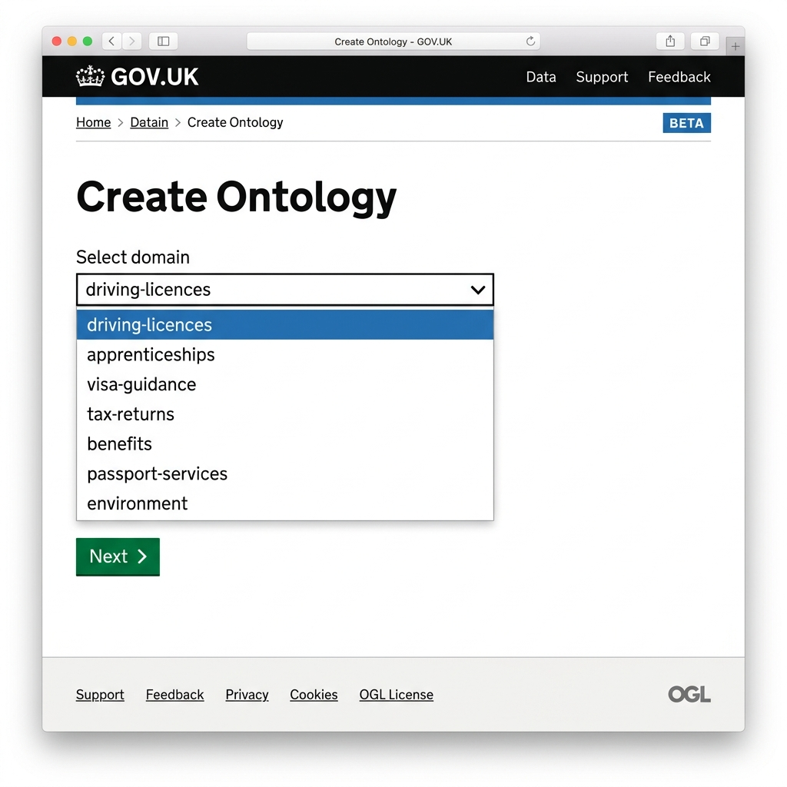
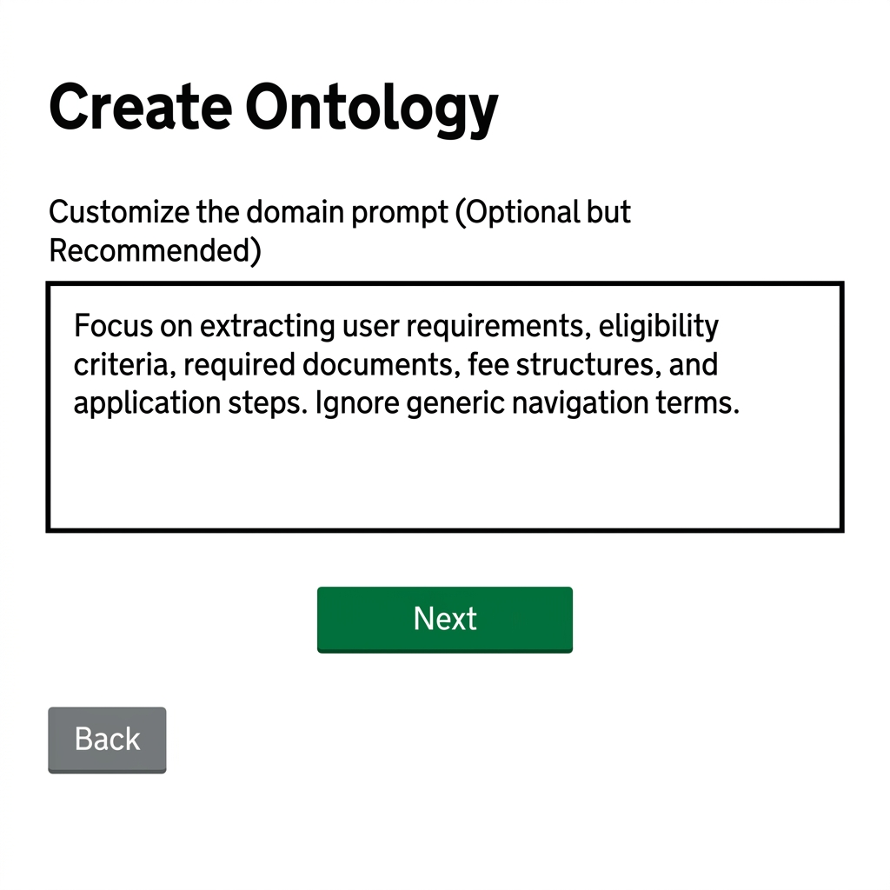
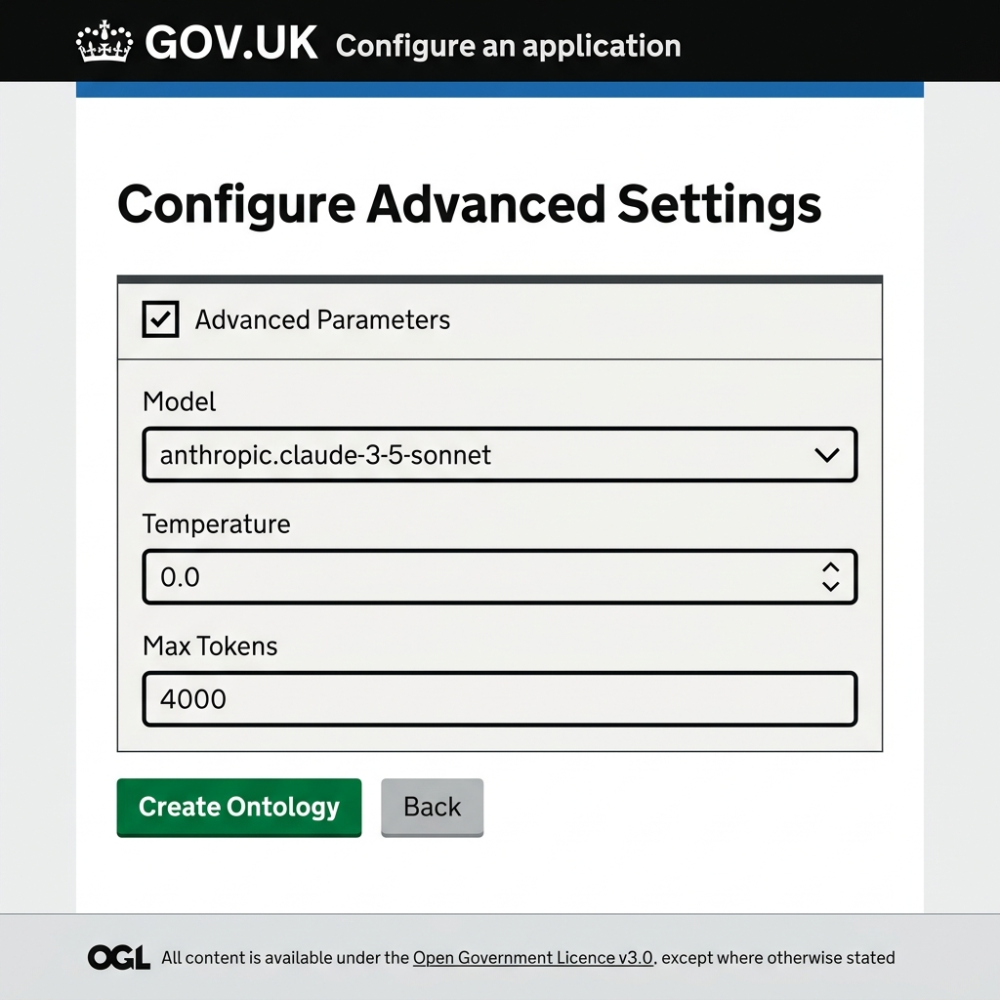
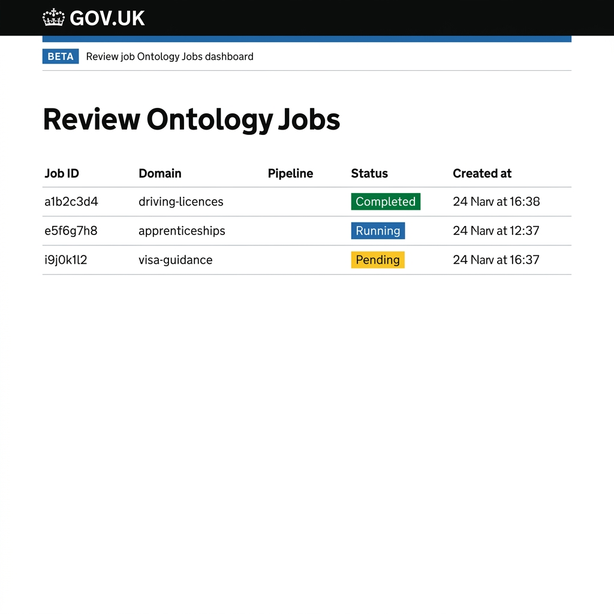
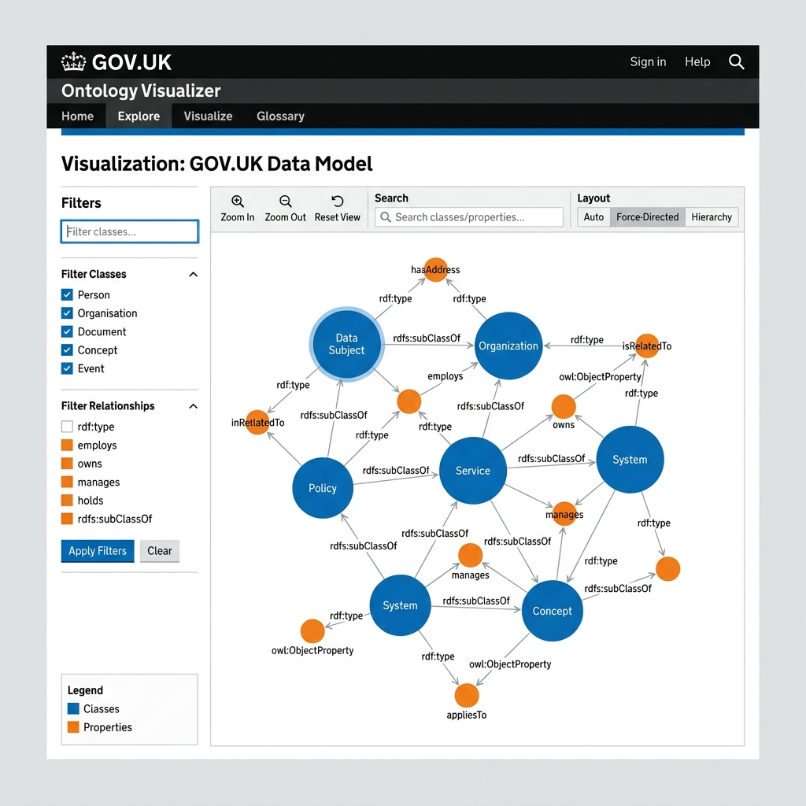
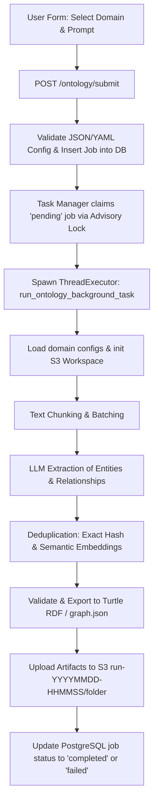

# Runbook: Ontology Generation Process

This guide provides a comprehensive runbook for the ontology generation process. It is split into two sections:
1. **[User Guide (Non-Technical)](#part-1-user-guide-non-technical)** - For Information Architects, Domain Experts, and Content Designers using the web interface.
2. **[Technical & Developer Reference](#part-2-technical--developer-reference)** - For software developers, platform engineers, and developers maintaining the pipeline code and infrastructure.

---

# Part 1: User Guide (Non-Technical)

## What is Ontology Generation?
Once a domain has been created and its GOV.UK pages have been ingested (cleaned and downloaded), you can generate a **seed ontology**. 

An ontology is a structured model of the concepts, relationships, and attributes that define a domain. The **Ontology Generator** uses Large Language Models (LLMs) to automatically read the ingested pages, identify important concepts, map their relationships, and format them into standard semantic web data.

---

## How to Generate an Ontology (UI Workflow)

Follow these steps to configure and trigger an ontology generation run:

### Step 1: Open the Application
Navigate to the **Create Ontology** page in your web browser:
Link: **[https://govuk-ai-accelerator-app.integration.publishing.service.gov.uk/ontology/create](https://govuk-ai-accelerator-app.integration.publishing.service.gov.uk/ontology/create)**

### Step 2: Choose Your Domain
Select the domain you want to process from the dropdown list.
- Only domains that have already been created and ingested successfully will appear in this list. If you do not see your domain, complete the domain ingestion process first.



### Step 3: Customize the Domain Prompt (Optional but Recommended)
The domain prompt guides the LLM on what type of information and concepts to extract.
1. Enter your instructions directly into the **Domain prompt text box** in the user interface. For example:
   > "Focus on extracting user requirements, eligibility criteria, required documents, fee structures, and application steps. Ignore generic navigation terms."
2. The prompt input is optional; if left blank, the generator uses built-in baseline prompts to create the ontology.



### Step 4: Configure Advanced Settings (Optional)
By default, if you do not modify any of the parameters in this step, the generator uses the **default configuration** settings automatically. However, you can toggle the **Advanced Parameters** checkbox to customize settings if needed.



Below is the complete, parameter-by-parameter reference guide to all settings available in the configuration:

---

### 1. Large Language Model Settings (`llm`)

| Parameter | Type / Format | Default | Description / Purpose |
|---|---|---|---|
| **`llm.model`** | String | `"bedrock:eu.anthropic.claude-sonnet-4-6"` | The target LLM. Supports Bedrock prefix (`bedrock:`) and models like Claude Sonnet. |
| **`llm.temperature`** | Float | `0.0` | Controls AI randomness. Use `0.0` for predictable, deterministic extraction. |
| **`llm.max_tokens`** | Integer | `16000` | Maximum token length for the model response. Higher values prevent text truncation. |
| **`llm.aws_bedrock_enabled`** | Boolean | `true` | Toggles Bedrock API integration. |
| **`llm.bedrock_enable_context_1m_beta`**| Boolean | `false` | Enables AWS Bedrock experimental 1M token context support. |
| **`llm.bedrock_context_1m_beta_flag`** | String | `"context-1m-2025-08-07"` | Bedrock model flag for the beta context feature. |
| **`llm.bedrock_read_timeout_seconds`** | Integer | `600` | Read timeout limit for Bedrock API calls. |
| **`llm.extraction_prompt_file`** | String / Null | `null` | Custom path to an override system extraction prompt. |
| **`llm.retries`** | Integer | `3` | Simple retry attempts count for API calls. |
| **`llm.retry_strategy.enabled`** | Boolean | `true` | Enables exponential backoff retry handler for rate limits. |
| **`llm.retry_strategy.strategy_type`** | Choice | `"exponential"` | Backoff mathematical strategy: `"exponential"`, `"linear"`, `"constant"`. |
| **`llm.retry_strategy.initial_delay`** | Float | `1.0` | Delay in seconds before initiating the first retry attempt. |
| **`llm.retry_strategy.max_delay`** | Float | `30.0` | Maximum limit on delays between retries. |
| **`llm.retry_strategy.backoff_multiplier`**| Float | `2.0` | The factor by which delay increases each retry. |
| **`llm.retry_strategy.jitter`** | Boolean | `true` | Adds random time variance to avoid coordinated request spikes. |
| **`llm.retry_strategy.retry_on_rate_limit`**| Boolean | `true` | Automatically retry on API 429 rate limit exceptions. |
| **`llm.retry_strategy.retry_on_timeout`** | Boolean | `true` | Automatically retry on API connection timeout errors. |
| **`llm.bedrock_quota_governor.enabled`**| Boolean | `true` | Active rate-limit governor guarding Bedrock client calls. |
| **`llm.bedrock_quota_governor.requests_per_minute`** | Integer | `7000` | Threshold of maximum requests allowed per minute. |
| **`llm.bedrock_quota_governor.tokens_per_minute`** | Integer | `3500000` | Threshold of maximum tokens allowed per minute. |
| **`llm.bedrock_quota_governor.max_concurrency`** | Integer | `10` | Maximum parallel threads communicating with AWS Bedrock. |
| **`llm.bedrock_quota_governor.window_seconds`** | Integer | `60` | Time window length for rate limitation tracking. |
| **`llm.bedrock_quota_governor.jitter_min_seconds`** | Float | `0.2` | Minimum random delay factor. |
| **`llm.bedrock_quota_governor.jitter_max_seconds`** | Float | `1.5` | Maximum random delay factor. |

---

### 2. Batching Settings (`batching`)

| Parameter | Type / Format | Default | Description / Purpose |
|---|---|---|---|
| **`batching.chunks_per_batch`** | Integer | `2` | Number of text chunks processed in a single LLM request. |
| **`batching.chunk_separator`** | String | `"\n\n---\n\n"` | Character boundary marking different chunks within a batch. |
| **`batching.file_level_scaffold_enabled`**| Boolean | `true` | Generates a per-file summary first to guide chunk-level consistency. |
| **`batching.input_token_ratio`** | Float | `0.5` | Fraction of context window reserved for input chunks. |
| **`batching.max_batch_size_anthropic`** | Integer | `4` | Hard limit on chunks per batch for Anthropic models. |
| **`batching.max_batch_text_length`** | Integer / Null | `null` | Safety limit on character count in a single batch. |
| **`batching.max_input_tokens`** | Integer | `32000` | Safety limit to prevent prompt sizing from collapsing batch size. |
| **`batching.min_batch_size`** | Integer | `1` | Lower bound on batch size. |
| **`batching.min_batch_tokens`** | Integer | `200` | Lower bound on tokens allocated per batch. |

---

### 3. Checkpointing Settings (`checkpointing`)

| Parameter | Type / Format | Default | Description / Purpose |
|---|---|---|---|
| **`checkpointing.enabled`** | Boolean | `true` | Enable state saving to resume jobs that fail mid-run. |
| **`checkpointing.auto_resume`** | Boolean | `true` | Automatically pick up progress from an existing checkpoint. |
| **`checkpointing.checkpoint_filename`** | String | `"processing_checkpoint.json"` | Saved progress filename. |
| **`checkpointing.flush_interval_batches`**| Integer | `100` | Write to disk interval based on batch count. |
| **`checkpointing.flush_timeout_seconds`** | Integer | `600` | Force flush checkpointer after time elapsed. |
| **`checkpointing.max_state_checkpoints`** | Integer | `3` | Limit on history retention of checkpoints. |
| **`checkpointing.persist_state`** | Boolean | `false` | Deep persistence of extraction state (opt-in). |
| **`checkpointing.state_checkpoint_stages`**| List | `['extraction', 'deduplication', 'schema']` | Specific stages where status checkpoints are persisted. |

---

### 4. Conflict Resolution & Deduplication Settings (`conflict_resolution`, `deduplication`)

| Parameter | Type / Format | Default | Description / Purpose |
|---|---|---|---|
| **`conflict_resolution.enabled`** | Boolean | `true` | Resolve properties conflict automatically. |
| **`conflict_resolution.strategy`** | Choice | `"higher_confidence"` | Resolving rule: pick value with higher LLM confidence score. |
| **`deduplication.conflict_resolution_strategy`** | Choice | `"confidence"` | Merge strategy: `"confidence"` or `"latest"`. |
| **`deduplication.enable_label_similarity_check`** | Boolean | `true` | Enforces lexical similarity on labels before allowing semantic merge. |
| **`deduplication.exact_threshold`** | Float | `1.0` | Match score for string-identity based deduplication. |
| **`deduplication.high_semantic_similarity`** | Float | `0.985` | Unconditional merge score for semantic vector distance. |
| **`deduplication.min_label_similarity`** | Float | `0.75` | Required character/token overlap score before merging. |
| **`deduplication.semantic_threshold`** | Float | `0.88` | General cosine similarity threshold for vector merges. |
| **`deduplication.faiss.threshold`** | Integer | `100` | Entity count trigger to shift from array search to FAISS indexing. |
| **`deduplication.faiss.batch_size`** | Integer | `100` | Search lookup batch size in FAISS. |
| **`deduplication.faiss.index_type`** | Choice | `"auto"` | Index structure strategy. |
| **`deduplication.faiss.rebuild_threshold`** | Integer | `10000` | Rebuild index after N insertions to maintain precision. |
| **`deduplication.faiss.top_k`** | Integer | `50` | Nearest neighbors depth searched. |

---

### 5. Semantic Embeddings Settings (`embeddings`)

| Parameter | Type / Format | Default | Description / Purpose |
|---|---|---|---|
| **`embeddings.model`** | String | `"bedrock:cohere.embed-multilingual-v3"` | Model used for semantic distance calculations. |
| **`embeddings.dimension`** | Integer | `1024` | Cohere vector size. (Gemini: `3072`, OpenAI Large: `1536`). |
| **`embeddings.batch_size`** | Integer | `100` | Text chunk array size dispatched for vector extraction. |
| **`embeddings.max_batch_size`** | Integer | `100` | System safety batch cap to avoid request memory limits. |
| **`embeddings.concurrency`** | Integer | `10` | Concurrency limit on embedding API workers. |
| **`embeddings.task_type`** | String | `"SEMANTIC_SIMILARITY"`| Embedding downstream task flag. |
| **`embeddings.cache.enabled`** | Boolean | `true` | Avoid recalculations by caching generated embeddings. |
| **`embeddings.cache.directory`** | String | `"domains/.cache"` | Cache files storage destination folder. |
| **`embeddings.cache.file`** | String | `"embeddings.json"` | Vector cache storage filename. |

---

### 6. Error Handling & Limits Settings (`error_handling`, `limits`)

| Parameter | Type / Format | Default | Description / Purpose |
|---|---|---|---|
| **`error_handling.continue_on_error`** | Boolean | `true` | Continues processing on non-fatal chunk failures. |
| **`error_handling.collect_severities`** | List | `['error', 'warning', 'info']` | Log details collected during execution. |
| **`error_handling.max_errors`** | Integer / Null | `null` | Error count limit before halting pipeline. |
| **`limits.max_entities`** | Integer / Null | `null` | Hard cap on total entities allowed. |
| **`limits.max_entity_types`** | Integer / Null | `null` | Hard cap on total classes (Entity Types). |
| **`limits.max_relationships`** | Integer / Null | `null` | Hard cap on total relationships allowed. |
| **`limits.max_relationship_types`** | Integer / Null | `null` | Hard cap on unique relation properties. |

---

### 7. Filesystem & Storage Options (`filesystem`, `output`)

| Parameter | Type / Format | Default | Description / Purpose |
|---|---|---|---|
| **`filesystem.protocol`** | Choice | `"s3"` | Storage interface: `"s3"`, `"local"`, `"gcs"`. |
| **`filesystem.options`** | Map | `{}` | Backend parameters (e.g. region keys). |
| **`output.base_directory`** | String | *(Auto-resolved)* | Run output files destination directory. |
| **`output.append_domain_name`** | Boolean | `false` | Append domain subfolder suffix dynamically. |
| **`output.compress_output`** | Boolean | `false` | Gzip output JSON files. |
| **`output.pretty_print`** | Boolean | `false` | Human-readable pretty format for S3 outputs. |
| **`output.include_metadata`** | Boolean | `true` | Include audit telemetry in output graphs. |
| **`output.type_aware_canonical_keys`**| Boolean | `true` | Prefixes keys with types to block collision. |
| **`output.graph_filename`** | String | `"graph.json"` | Network visualization target file. |
| **`output.schema_filename`** | String | `"schema.json"` | Taxonomy mapping target file. |
| **`output.export.enabled`** | Boolean | `true` | RDF translation activation flag. |
| **`output.export.format`** | Choice | `"turtle"` | RDF encoding syntax (`"turtle"` or `"rdfxml"`). |
| **`output.export.base_uri`** | String | `"http://example.org/ontology"`| Global RDF ontology target namespace. |
| **`output.export.min_property_frequency`**| Integer | `4` | Ignore properties seen fewer than N times. |

---

### 8. Naming Conventions (`naming_conventions`)

| Parameter | Type / Format | Default | Description / Purpose |
|---|---|---|---|
| **`naming_conventions.enabled`** | Boolean | `true` | Active normalization enforcement. |
| **`naming_conventions.entity_type_casing`**| Choice | `"UpperCamelCase"` | Class casing (e.g. `MedicalConcept`). |
| **`naming_conventions.property_casing`** | Choice | `"lowerCamelCase"` | Attribute casing (e.g. `startDate`). |
| **`naming_conventions.relationship_type_casing`**| Choice | `"lowerCamelCase"`| Relationship type casing. |
| **`naming_conventions.entity_label_spelling_variant`**| Choice | `"UK"` | Language mapping preference. |
| **`naming_conventions.entity_iri_spelling_variant`**| Choice | `"US"` | Global identifier format. |

---

### 9. Relationship Processing (`relationship_processing`)

| Parameter | Type / Format | Default | Description / Purpose |
|---|---|---|---|
| **`relationship_processing.auto_create_missing_entities`** | Boolean | `true` | Automatically create missing nodes to avoid losing relations. |
| **`relationship_processing.auto_created_entity_confidence`**| Float | `0.5` | Lower confidence factor assigned to implied nodes. |
| **`relationship_processing.auto_created_entity_default_type`**| String | `"entity"` | Default class type for implied nodes. |

---

### 10. Web Research Settings (`research`)

| Parameter | Type / Format | Default | Description / Purpose |
|---|---|---|---|
| **`research.max_fetches`** | Integer | `50` | Maximum pages gathered during exploration. |
| **`research.allowed_domains`** | List | `[]` | Limit lookup to specific domain patterns. |
| **`research.blocked_domains`** | List | `[]` | Blacklist specific sites. |
| **`research.num_queries`** | Integer | `5` | Generated LLM queries count. |
| **`research.results_per_query`** | Integer | `10` | Results returned from search engine per query. |
| **`research.http_timeout`** | Float | `30.0` | Maximum wait for web response. |

---

### 11. Schema Evolution Settings (`schema_evolution`)

| Parameter | Type / Format | Default | Description / Purpose |
|---|---|---|---|
| **`schema_evolution.type_similarity_threshold`**| Float | `0.75` | Distance score allowed before merging classes. |
| **`schema_evolution.default_entity_type`**| String | `"entity"` | Fallback type when missing. |
| **`schema_evolution.initial_version`** | String | `"1.0"` | Baseline version. |
| **`schema_evolution.version_increment`** | Choice | `"patch"` | Version progression: `"major"`, `"minor"`, `"patch"`. |

---

### 12. Source Grounding Settings (`source_grounding`)

| Parameter | Type / Format | Default | Description / Purpose |
|---|---|---|---|
| **`source_grounding.enabled`** | Boolean | `true` | Maps data points back to source files. |
| **`source_grounding.source_property_name`**| String | `"sourceUrls"` | Metadata key holding origin paths. |
| **`source_grounding.merge_sources_on_deduplication`**| Boolean | `true` | Combines sources when merging duplicate terms. |

---

### 13. Text Processing Settings (`text_processing`)

| Parameter | Type / Format | Default | Description / Purpose |
|---|---|---|---|
| **`text_processing.chunking.chunk_size`**| Integer | `2500` | Size in characters of chunks. |
| **`text_processing.chunking.chunk_overlap`**| Integer | `250` | Character overlap. |
| **`text_processing.chunking.min_chunk_size`**| Integer | `100` | Rejects tiny fragment chunks. |
| **`text_processing.normalization.casing`**| Choice | `"lowercase"` | Target normalization casing. |
| **`text_processing.normalization.punctuation_handling`**| Choice | `"remove"` | Casing/punctuation handler strategy. |

---

### 14. Performance & Feature Flags (`performance`, `features`)

| Parameter | Type / Format | Default | Description / Purpose |
|---|---|---|---|
| **`performance.llm_cache_enabled`** | Boolean | `true` | Cache LLM text generation calls locally. |
| **`performance.embedding_cache_enabled`**| Boolean | `true` | Cache embedding calculation responses. |
| **`performance.max_cache_size_mb`** | Integer | `500` | Storage cache memory cap. |
| **`features.schema_evolution`** | Boolean | `true` | Allow taxonomy discovery. |
| **`features.incremental_updates`** | Boolean | `true` | Runs comparison on existing artifacts. |
| **`features.conflict_resolution`** | Boolean | `true` | Resolve conflicts during merges. |
| **`features.cross_session_deduplication`**| Boolean | `true` | Deduplicates terms across previous jobs. |
| **`parallel_files`** | Integer | `1` | Number of files processed in parallel. |
| **`batch_api_enabled`** | Boolean | `false` | Enable batch LLM request API. |
| **`term_extraction.enabled`** | Boolean | `false` | Enable intermediate terminology phase. |
| **`upper_ontology_enabled`** | Boolean | `true` | Enforces structural hierarchy consistency. |

---

### Step 5: Submit the Generation Job
Click the green **Create Ontology** button at the bottom of the page.
- Once submitted, you will receive a **Job ID** and a confirmation screen.

---

## Monitoring and Reviewing Generated Ontologies

### Step 1: Open the Jobs Dashboard
Go to **Review Ontology**:
Link: **[https://govuk-ai-accelerator-app.integration.publishing.service.gov.uk/ontology/jobs/review](https://govuk-ai-accelerator-app.integration.publishing.service.gov.uk/ontology/jobs/review)**

### Step 2: View Your Job
Look for your domain name and Job ID in the dashboard. Jobs progress through the following statuses:
- ⏳ **Pending:** The job is queued and waiting for an available background worker.
- ⚙️ **Running:** The worker is processing your domain pages (chunking, calling the LLM, deduplicating).
- ✅ **Completed:** The ontology was successfully generated and saved.
- 🛑 **Stopped:** The job was manually terminated by a user.
- ❌ **Failed:** An error occurred (e.g., LLM rate limits or incorrect configuration).



### Step 3: Access Generated Artifacts
Click on a completed job to expand its details and download the output files:

| Artifact Name | Description | Recommended Action |
|---|---|---|
| **`ontology.ttl`** | The raw ontology file formatted in standard RDF Turtle syntax. | Download to import into external ontology editors (e.g., Protégé). |
| **`graph.json`** | Visual representation of the ontology network. | Used by the interactive visualizer. |
| **`schema.json`** | Summarizes the classes, properties, and relationship types discovered. | Quick text review of the ontology structure. |
| **`stdout.log`** | Detailed runtime logs for debugging. | Send to developers if the job fails. |
| **`bedrock_costs.csv`** | Approximate API costs incurred by the LLM during this run. | Review for budgeting and scaling analysis. |

### Step 4: Visualize Your Ontology
For any completed job, click the **Visualize Ontology** link. This opens the interactive visualizer, allowing you to search nodes, filter relationship types, and inspect the structure of your generated ontology.



### Step 5: Job Notes and Collaboration
You can add annotations, comments, or review notes directly to a job:
1. Click **Add Note** under the job details panel.
2. Enter your observations (e.g., "The model extracted visa classes correctly but missed some minor sub-relationships").
3. Click **Save Note**. These notes are saved to the database and can be viewed by all team members.

---

# Part 2: Technical & Developer Reference

This section is for software developers and infrastructure engineers maintaining the ontology pipeline.

## Technical Architecture

The ontology generation pipeline utilizes an asynchronous task queue managed within the web app and executed via background worker threads:



Key files involved in this pipeline:
- **Web Interface:** [govuk_ai_accelerator_app.py](file:///Users/ademolaadefioye/Desktop/GDS/govuk-ai-accelerator/govuk_ai_accelerator_app.py) handles HTTP requests and manages database records for `ProcessingJob`.
- **Pipeline Orchestrator:** [scripts/pipeline/ontology_generator.py](file:///Users/ademolaadefioye/Desktop/GDS/govuk-ai-accelerator/scripts/pipeline/ontology_generator.py) defines the asynchronous processing steps and finalizes results.
- **Task Worker Queue:** [scripts/pipeline/task_manager.py](file:///Users/ademolaadefioye/Desktop/GDS/govuk-ai-accelerator/scripts/pipeline/task_manager.py) leases pending jobs, runs them concurrently, and manages leases/timeouts.
- **Config Management:** [scripts/pipeline/utils.py](file:///Users/ademolaadefioye/Desktop/GDS/govuk-ai-accelerator/scripts/pipeline/utils.py) parses parameters and maps domain properties.

### Integration Libraries
- **`boto3`**: The pipeline interfaces directly with AWS Bedrock APIs for text generation (e.g. Anthropic Claude models) and embedding calculations (e.g. Cohere Multilingual Embeddings).
- **`fsspec`**: Handles unified storage protocols. Based on the domain configuration (like `filesystem.protocol`), `fsspec` abstracts all input/output reads and writes to local directories or AWS S3 buckets seamlessly.

---

## Detailed Pipeline Execution Stages

When `run_ontology_background_task` is executed, it invokes the following workflow stages:

1. **Setup Pipeline (`setup_pipeline`):**
   - Resolves input paths (usually pointing to `s3://<bucket>/<domain>/input/`).
   - Resolves output directory (usually `s3://<bucket>/<domain>/run-<datetime>/`).
   - If `incremental: true` is set, loads existing ontology artifacts from S3 so new extractions can build upon them.

2. **Extraction Stage (`_extract_ontology`):**
   - **Chunking:** Parses input markdown files into text chunks based on the configured token size (default: 4000 tokens) and overlap (default: 100 tokens).
   - **Batching:** Groups multiple chunks together to optimize LLM call throughput and minimize API latency.
   - **LLM Calls:** Invokes the Bedrock or Anthropic API to perform structured zero-shot / few-shot entity and relationship extraction.

3. **Processing Stage (`_process_ontology`):**
   - **Deduplication:** Merges identical entities using a two-stage method:
     1. *Exact:* Hash-based exact string matching on entity labels.
     2. *Semantic:* Generates embeddings (default: `bedrock:cohere.embed-multilingual-v3`) and uses cosine similarity / FAISS to merge synonyms and spelling variants.
   - **Relation Building:** Links entities using extracted properties.
   - **Schema Evolution:** Automatically identifies and merges newly discovered entity types or relationship patterns into the global schema definitions.

4. **Graph Exporter (`_create_ontology_graph`):**
   - Converts extracted data structures into standard RDF graph representations.
   - Exports the graph into:
     - `ontology.ttl` (Turtle RDF/OWL ontology).
     - `graph.json` (Network graph for visualization).
     - `schema.json` (Taxonomy / schema overview).

5. **Finalize Stage (`_save_pipeline_output`):**
   - Uploads files and cost/performance logs (`bedrock_costs.csv`, `owl_ontology_metrics.csv`) to S3.
   - Saves a copy of the configuration (`config.yaml`) and system prompts (`prompts.txt`) to the output path.

---

## Storage Directory Layout (S3)

Outputs from ontology runs are written under the domain name with unique timestamped directories. No intermediate chunk/embedding database files or archives are saved to S3:

```text
s3://<bucket_name>/<domain_name>/
├── input/
│   ├── <slug>.md
│   └── sources.json
├── run-YYYYMMDD-HHMMSS/              # Single run workspace
│   ├── config.yaml                   # The exact configuration used
│   ├── prompts.txt                   # Prompt instructions used
│   ├── stdout.log                    # Run logs
│   └── output/                       # Output files
│       ├── ontology.ttl              # Turtle RDF ontology
│       ├── graph.json                # Network graph JSON
│       ├── schema.json               # Schema JSON
│       ├── bedrock_costs.csv         # Cost metrics
│       ├── owl_ontology_metrics.csv  # Node/Edge counts
│       └── deduplication_summary.json
```

---

## Task Manager, Database Queue, & Configuration

The background execution queue relies on PostgreSQL transactions and metadata tables for job synchronization.

### Database Schema Structure

#### 1. `ProcessingJob`
Stores the configuration, logs, and current status of all ingestion and ontology generation jobs:
- `id` (String, Primary Key): Unique job ID (UUID).
- `status` (String): Status of the job (`pending`, `running`, `completed`, `stopped`, `failed`).
- `pipeline` (String): The type of execution pipeline (`ingestion`, `ontology`, or `ontology-harness`).
- `domain` (String): The domain name (e.g. `housing`).
- `config_data` (Text): JSON string representation of the config dictionary.
- `domain_prompt` (Text): The custom prompt guidelines typed by the user.
- `attempt_count` (Integer): Number of execution attempts.
- `claimed_by` (String): Hostname of the worker pod currently running the job.
- `claimed_at` (DateTime) & `heartbeat_at` (DateTime): Lease tracking timestamps.

#### 2. `ProcessingJobNote`
Stores annotations added by team members to individual jobs:
- `id` (Integer, Primary Key): Auto-increment note ID.
- `job_id` (String, Foreign Key): Links to `ProcessingJob.id`.
- `text` (Text): The note content.
- `created_at` (DateTime) & `updated_at` (DateTime): Timestamps for note creation.

### Task Management Mechanisms
To prevent duplicate processing in scaled/containerized environments, the application uses **PostgreSQL Advisory Locks** for leader election:

- **Leader Election:** The task manager thread calls `SELECT pg_try_advisory_lock(420021)` to ensure only one pod processes queue maintenance operations (like job cleanup and requeuing).
- **Lease Claiming:** Workers claim jobs using a database transaction with `SELECT ... FOR UPDATE SKIP LOCKED` on the `ProcessingJob` table. This updates job state to `running` and signs the `claimed_by` column with the hostname.
- **Heartbeat & Recovery:** If a worker crashes, the job remains in `running`. The leader checks jobs running longer than `PROGRESS_TIMEOUT_MINUTES` (default: 45) and requeues them up to `MAX_JOB_ATTEMPTS` (default: 2) before marking them as failed.

### Environment Variable Settings
The following variables govern the queue:
- `PROGRESS_TIMEOUT_MINUTES` (default: `45`): The timeframe after which a running job with no progress updates is considered stale.
- `MAX_JOB_ATTEMPTS` (default: `2`): The limit of requeue attempts for failed/stale tasks.
- `S3_BUCKET_NAME` (default: `govuk-ai-accelerator-data-integration`): The destination bucket for pipeline read/write.

---

## Local Development & CLI Usage

### Running the Pipeline locally
Developers can run a local task worker that listens to the database and processes queued ontology generation jobs:

```bash
# 1. Export AWS credentials for Bedrock and S3 access
export AWS_ACCESS_KEY_ID="your-key"
export AWS_SECRET_ACCESS_KEY="your-secret"
export S3_BUCKET_NAME="govuk-ai-accelerator-data-integration"

# 2. Boot the Flask app (which starts the task manager thread automatically)
source environment.sh
uv run govuk_ai_accelerator_app.py
```

### Triggering Ingestion & Ontology Scripting
To trigger an ontology run directly from Python without spawning the Flask UI:

```bash
uv run python -c "
import asyncio
from scripts.pipeline.ontology_generator import run_ontology_pipeline

config_override = {
    'domain_name': 'tenancy-rules',
    'path': {
        'input_path': 's3://govuk-ai-accelerator-data-integration/tenancy-rules/input',
        'output_dir': 's3://govuk-ai-accelerator-data-integration/tenancy-rules/manual-run'
    }
}

async def main():
    path = await run_ontology_pipeline(
        config_data=config_override,
        domain_prompt='Focus on landlord and tenant obligations.'
    )
    print(f'Ontology saved to: {path}')

asyncio.run(main())
"
```

