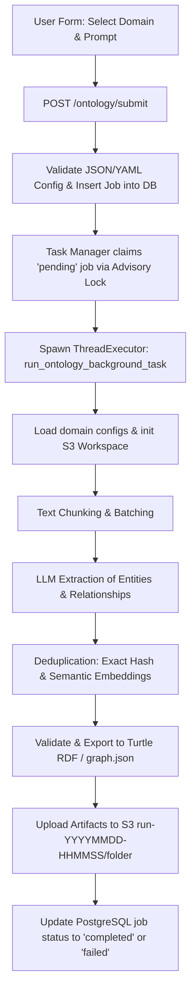

# Runbook: Ontology Generation Process

This guide provides a comprehensive runbook for the ontology generation process. It is split into two sections:
1. **[User Guide (Non-Technical)](#part-1-user-guide-non-technical)** - For Information Architects, Domain Experts, and Content Designers using the web interface.
2. **[Technical & Developer Reference](#part-2-technical--developer-reference)** - For software developers, platform engineers, and developers maintaining the pipeline code and infrastructure.

---

# Part 1: User Guide (Non-Technical)

## What is Ontology Generation?
Once a domain has been created and its GOV.UK pages have been ingested (cleaned and downloaded), you can generate a **seed ontology**. 

An ontology is a structured model of the concepts, relationships, and attributes that define a domain. The **Ontology Generator** uses Large Language Models (LLMs) to automatically read the ingested pages, identify important concepts, map their relationships, and format them into standard semantic web data.

---

## How to Generate an Ontology (UI Workflow)

Follow these steps to configure and trigger an ontology generation run:

### Step 1: Open the Application
Navigate to the **Create Ontology** page in your web browser:
Link: **[https://govuk-ai-accelerator-app.integration.publishing.service.gov.uk/ontology/create](https://govuk-ai-accelerator-app.integration.publishing.service.gov.uk/ontology/create)**

### Step 2: Choose Your Domain
Select the domain you want to process from the dropdown list.
- Only domains that have already been created and ingested successfully will appear in this list. If you do not see your domain, complete the domain ingestion process first.


### Step 3: Customize the Domain Prompt (Optional but Recommended)
The domain prompt guides the LLM on what type of information and concepts to extract.
1. Enter your instructions directly into the **Domain prompt text box** in the user interface. For example:
   > "Focus on extracting user requirements, eligibility criteria, required documents, fee structures, and application steps. Ignore generic navigation terms."
2. The prompt input is optional; if left blank, the generator uses built-in baseline prompts to create the ontology.


### Step 4: Configure Advanced Settings (Optional)
By default, if you do not modify any of the parameters in this step, the generator uses the **default configuration** settings automatically. However, you can toggle the **Advanced Parameters** checkbox to customize settings if needed:
- **Model:** Specifies which LLM to use (e.g., Anthropic Claude or AWS Bedrock model).
- **Temperature:** Controls LLM creativity. Set to `0.0` for maximum consistency and reproducibility.
- **Max Tokens:** The maximum length of the model's response.


### Step 5: Submit the Generation Job
Click the green **Create Ontology** button at the bottom of the page.
- Once submitted, you will receive a **Job ID** and a confirmation screen.

---

## Monitoring and Reviewing Generated Ontologies

### Step 1: Open the Jobs Dashboard
Go to **Review Ontology**:
Link: **[https://govuk-ai-accelerator-app.integration.publishing.service.gov.uk/ontology/jobs/review](https://govuk-ai-accelerator-app.integration.publishing.service.gov.uk/ontology/jobs/review)**

### Step 2: View Your Job
Look for your domain name and Job ID in the dashboard. Jobs progress through the following statuses:
- ⏳ **Pending:** The job is queued and waiting for an available background worker.
- ⚙️ **Running:** The worker is processing your domain pages (chunking, calling the LLM, deduplicating).
- ✅ **Completed:** The ontology was successfully generated and saved.
- 🛑 **Stopped:** The job was manually terminated by a user.
- ❌ **Failed:** An error occurred (e.g., LLM rate limits or incorrect configuration).


### Step 3: Access Generated Artifacts
Click on a completed job to expand its details and download the output files:

| Artifact Name | Description | Recommended Action |
|---|---|---|
| **`ontology.ttl`** | The raw ontology file formatted in standard RDF Turtle syntax. | Download to import into external ontology editors (e.g., Protégé). |
| **`graph.json`** | Visual representation of the ontology network. | Used by the interactive visualizer. |
| **`schema.json`** | Summarizes the classes, properties, and relationship types discovered. | Quick text review of the ontology structure. |
| **`stdout.log`** | Detailed runtime logs for debugging. | Send to developers if the job fails. |
| **`bedrock_costs.csv`** | Approximate API costs incurred by the LLM during this run. | Review for budgeting and scaling analysis. |

### Step 4: Visualize Your Ontology
For any completed job, click the **Visualize Ontology** link. This opens the interactive visualizer, allowing you to search nodes, filter relationship types, and inspect the structure of your generated ontology.


### Step 5: Job Notes and Collaboration
You can add annotations, comments, or review notes directly to a job:
1. Click **Add Note** under the job details panel.
2. Enter your observations (e.g., "The model extracted visa classes correctly but missed some minor sub-relationships").
3. Click **Save Note**. These notes are saved to the database and can be viewed by all team members.

---

# Part 2: Technical & Developer Reference

This section is for software developers and infrastructure engineers maintaining the ontology pipeline.

## Technical Architecture

The ontology generation pipeline utilizes an asynchronous task queue managed within the web app and executed via background worker threads:



Key files involved in this pipeline:
- **Web Interface:** [govuk_ai_accelerator_app.py](file:///Users/ademolaadefioye/Desktop/GDS/govuk-ai-accelerator/govuk_ai_accelerator_app.py) handles HTTP requests and manages database records for `ProcessingJob`.
- **Pipeline Orchestrator:** [scripts/pipeline/ontology_generator.py](file:///Users/ademolaadefioye/Desktop/GDS/govuk-ai-accelerator/scripts/pipeline/ontology_generator.py) defines the asynchronous processing steps and finalizes results.
- **Task Worker Queue:** [scripts/pipeline/task_manager.py](file:///Users/ademolaadefioye/Desktop/GDS/govuk-ai-accelerator/scripts/pipeline/task_manager.py) leases pending jobs, runs them concurrently, and manages leases/timeouts.
- **Config Management:** [scripts/pipeline/utils.py](file:///Users/ademolaadefioye/Desktop/GDS/govuk-ai-accelerator/scripts/pipeline/utils.py) parses parameters and maps domain properties.

### Integration Libraries
- **`boto3`**: The pipeline interfaces directly with AWS Bedrock APIs for text generation (e.g. Anthropic Claude models) and embedding calculations (e.g. Cohere Multilingual Embeddings).
- **`fsspec`**: Handles unified storage protocols. Based on the domain configuration (like `filesystem.protocol`), `fsspec` abstracts all input/output reads and writes to local directories or AWS S3 buckets seamlessly.

---

## Detailed Pipeline Execution Stages

When `run_ontology_background_task` is executed, it invokes the following workflow stages:

1. **Setup Pipeline (`setup_pipeline`):**
   - Resolves input paths (usually pointing to `s3://<bucket>/<domain>/input/`).
   - Resolves output directory (usually `s3://<bucket>/<domain>/run-<datetime>/`).
   - If `incremental: true` is set, loads existing ontology artifacts from S3 so new extractions can build upon them.

2. **Extraction Stage (`_extract_ontology`):**
   - **Chunking:** Parses input markdown files into text chunks based on the configured token size (default: 4000 tokens) and overlap (default: 100 tokens).
   - **Batching:** Groups multiple chunks together to optimize LLM call throughput and minimize API latency.
   - **LLM Calls:** Invokes the Bedrock or Anthropic API to perform structured zero-shot / few-shot entity and relationship extraction.

3. **Processing Stage (`_process_ontology`):**
   - **Deduplication:** Merges identical entities using a two-stage method:
     1. *Exact:* Hash-based exact string matching on entity labels.
     2. *Semantic:* Generates embeddings (default: `bedrock:cohere.embed-multilingual-v3`) and uses cosine similarity / FAISS to merge synonyms and spelling variants.
   - **Relation Building:** Links entities using extracted properties.
   - **Schema Evolution:** Automatically identifies and merges newly discovered entity types or relationship patterns into the global schema definitions.

4. **Graph Exporter (`_create_ontology_graph`):**
   - Converts extracted data structures into standard RDF graph representations.
   - Exports the graph into:
     - `ontology.ttl` (Turtle RDF/OWL ontology).
     - `graph.json` (Network graph for visualization).
     - `schema.json` (Taxonomy / schema overview).

5. **Finalize Stage (`_save_pipeline_output`):**
   - Uploads files and cost/performance logs (`bedrock_costs.csv`, `owl_ontology_metrics.csv`) to S3.
   - Saves a copy of the configuration (`config.yaml`) and system prompts (`prompts.txt`) to the output path.

---

## Storage Directory Layout (S3)

Outputs from ontology runs are written under the domain name with unique timestamped directories. No intermediate chunk/embedding database files or archives are saved to S3:

```text
s3://<bucket_name>/<domain_name>/
├── input/
│   ├── <slug>.md
│   └── sources.json
├── run-YYYYMMDD-HHMMSS/              # Single run workspace
│   ├── config.yaml                   # The exact configuration used
│   ├── prompts.txt                   # Prompt instructions used
│   ├── stdout.log                    # Run logs
│   └── output/                       # Output files
│       ├── ontology.ttl              # Turtle RDF ontology
│       ├── graph.json                # Network graph JSON
│       ├── schema.json               # Schema JSON
│       ├── bedrock_costs.csv         # Cost metrics
│       ├── owl_ontology_metrics.csv  # Node/Edge counts
│       └── deduplication_summary.json
```

---

## Task Manager, Database Queue, & Configuration

The background execution queue relies on PostgreSQL transactions and metadata tables for job synchronization.

### Database Schema Structure

#### 1. `ProcessingJob`
Stores the configuration, logs, and current status of all ingestion and ontology generation jobs:
- `id` (String, Primary Key): Unique job ID (UUID).
- `status` (String): Status of the job (`pending`, `running`, `completed`, `stopped`, `failed`).
- `pipeline` (String): The type of execution pipeline (`ingestion`, `ontology`, or `ontology-harness`).
- `domain` (String): The domain name (e.g. `housing`).
- `config_data` (Text): JSON string representation of the config dictionary.
- `domain_prompt` (Text): The custom prompt guidelines typed by the user.
- `attempt_count` (Integer): Number of execution attempts.
- `claimed_by` (String): Hostname of the worker pod currently running the job.
- `claimed_at` (DateTime) & `heartbeat_at` (DateTime): Lease tracking timestamps.

#### 2. `ProcessingJobNote`
Stores annotations added by team members to individual jobs:
- `id` (Integer, Primary Key): Auto-increment note ID.
- `job_id` (String, Foreign Key): Links to `ProcessingJob.id`.
- `text` (Text): The note content.
- `created_at` (DateTime) & `updated_at` (DateTime): Timestamps for note creation.

### Task Management Mechanisms
To prevent duplicate processing in scaled/containerized environments, the application uses **PostgreSQL Advisory Locks** for leader election:

- **Leader Election:** The task manager thread calls `SELECT pg_try_advisory_lock(420021)` to ensure only one pod processes queue maintenance operations (like job cleanup and requeuing).
- **Lease Claiming:** Workers claim jobs using a database transaction with `SELECT ... FOR UPDATE SKIP LOCKED` on the `ProcessingJob` table. This updates job state to `running` and signs the `claimed_by` column with the hostname.
- **Heartbeat & Recovery:** If a worker crashes, the job remains in `running`. The leader checks jobs running longer than `PROGRESS_TIMEOUT_MINUTES` (default: 45) and requeues them up to `MAX_JOB_ATTEMPTS` (default: 2) before marking them as failed.

### Environment Variable Settings
The following variables govern the queue:
- `PROGRESS_TIMEOUT_MINUTES` (default: `45`): The timeframe after which a running job with no progress updates is considered stale.
- `MAX_JOB_ATTEMPTS` (default: `2`): The limit of requeue attempts for failed/stale tasks.
- `S3_BUCKET_NAME` (default: `govuk-ai-accelerator-data-integration`): The destination bucket for pipeline read/write.

---

## Local Development & CLI Usage

### Running the Pipeline locally
Developers can run a local task worker that listens to the database and processes queued ontology generation jobs:

```bash
# 1. Export AWS credentials for Bedrock and S3 access
export AWS_ACCESS_KEY_ID="your-key"
export AWS_SECRET_ACCESS_KEY="your-secret"
export S3_BUCKET_NAME="govuk-ai-accelerator-data-integration"

# 2. Boot the Flask app (which starts the task manager thread automatically)
source environment.sh
uv run govuk_ai_accelerator_app.py
```

### Triggering Ingestion & Ontology Scripting
To trigger an ontology run directly from Python without spawning the Flask UI:

```bash
uv run python -c "
import asyncio
from scripts.pipeline.ontology_generator import run_ontology_pipeline

config_override = {
    'domain_name': 'tenancy-rules',
    'path': {
        'input_path': 's3://govuk-ai-accelerator-data-integration/tenancy-rules/input',
        'output_dir': 's3://govuk-ai-accelerator-data-integration/tenancy-rules/manual-run'
    }
}

async def main():
    path = await run_ontology_pipeline(
        config_data=config_override,
        domain_prompt='Focus on landlord and tenant obligations.'
    )
    print(f'Ontology saved to: {path}')

asyncio.run(main())
"
```

