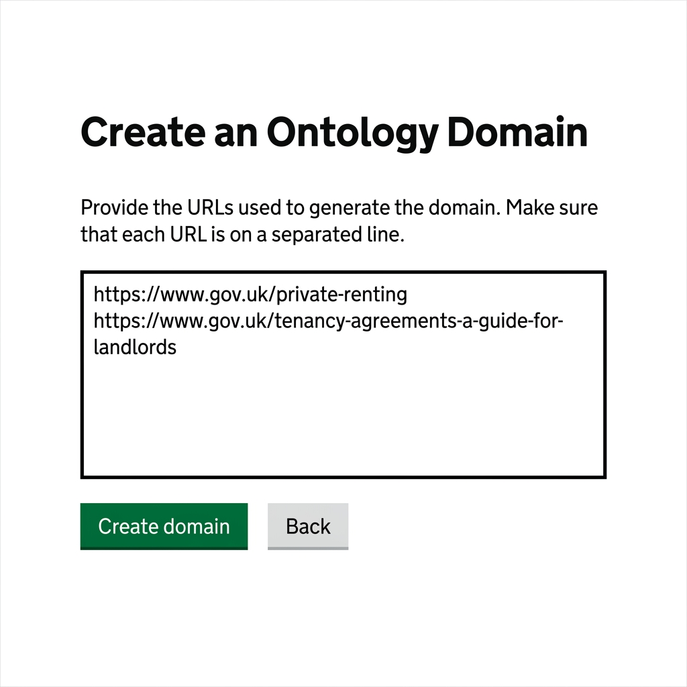
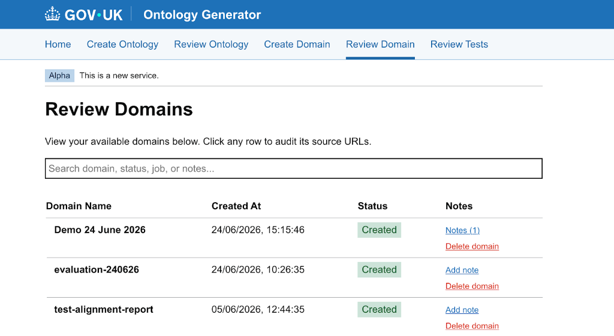

# Runbook: Domain Creation and Ingestion

This guide is split into two sections:
1. **[User Guide (Non-Technical)](#part-1-user-guide-non-technical)** - For Information Architects, Content Designers, and anyone using the web interface.
2. **[Technical & Developer Reference](#part-2-technical--developer-reference)** - For software developers and engineers maintaining the application.

---

# Part 1: User Guide (Non-Technical)

## What is this tool?

Before pages can be processed, they need to be downloaded from GOV.UK and cleaned. This tool does two things:
- **Domain Creation:** Groups a list of GOV.UK pages together under a single topic name (a "domain", such as `housing` or `visa-guidance`).
- **Ingestion:** Automatically visits each link, strips out web page noise (like navigation headers, footer links, and print buttons), converts the core text into clean Markdown format, and stores it in the cloud.

---

## How to Create a Domain & Ingest Pages (UI Workflow)

Follow these steps to download and clean GOV.UK pages for a new domain:

### Step 1: Open the Application
Navigate to the deployed application in your web browser:
Link: **[https://govuk-ai-accelerator-app.integration.publishing.service.gov.uk/ontology/domains](https://govuk-ai-accelerator-app.integration.publishing.service.gov.uk/ontology/domains)**

### Step 2: Name Your Domain
1. On the **Create an Ontology Domain** wizard page, click the green **Start** button.
2. Under *Provide the name of your domain*, type a short, descriptive name using lowercase letters and hyphens (e.g., `driving-licences`, `apprenticeships`, `tenancy-rules`).
   > [!IMPORTANT]
   > Please avoid adding spaces in the name of the domain.
3. Click the **Next** button.

### Step 3: Paste Your GOV.UK Links
1. Paste the list of GOV.UK links you want to ingest into the text box.
   
2. Follow these **Crucial Formatting Guidelines**:
   - **One link per line:** Enter exactly one URL on each line.
   - **No trailing punctuation:** Do not add commas (`,`), colons (`:`), semicolons (`;`), or other symbols at the end of the links.
   - **No text labels:** Do not include descriptive labels, titles, or comments next to the links.
   - **Complete URLs starting with `https://` only:** Every link must start with `https://`. Links starting with `www.` (missing `https://`) will be skipped.

   **Correct Input Example:**
   ```text
   https://www.gov.uk/private-renting
   https://report-error-evisa.homeoffice.gov.uk/guidance
   ```

   **Incorrect Input Example:**
   ```text
   www.gov.uk/private-renting              (Missing https:// - will be skipped)
   https://www.gov.uk/private-renting,     (Trailing comma - will fail)
   https://www.gov.uk/visa-fees;           (Trailing semicolon - will fail)
   /visa-fees                              (Relative path - will be skipped)
   ```
3. Click the **Create domain** button.

### Step 4: Monitor Ingestion Progress
1. Once submitted, you will see a confirmation box displaying a **Job ID**.
2. Click the **Review Domain** button.
3. This opens the dashboard showing all active domains. Look for your domain in the list:
   - ⏳ **Pending / Running:** The tool is currently visiting the websites and downloading the content.
   - ✅ **Completed:** All pages were successfully downloaded, cleaned, and stored in the cloud.
   - ❌ **Failed:** Something went wrong (e.g., no valid links were provided).

   

---

## Troubleshooting for Non-Technical Users

If your domain ingestion run fails or skips some pages, toggle the sections below to find resolutions:

<details>
<summary><b>Missing https:// prefix</b></summary>

Ensure all URLs begin with `https://`. URLs starting directly with `www.` will be skipped because the system cannot recognise them without the security protocol.
</details>

<details>
<summary><b>Formatting Characters</b></summary>

Verify there are no commas, colons, or trailing spaces in the URL text box. Even a single trailing comma can cause a URL to fail to load.
</details>

<details>
<summary><b>Website Domain</b></summary>

The link must belong to a domain ending in `.gov.uk` (for example, standard pages like `https://www.gov.uk/...` or subdomains like `https://report-error-evisa.homeoffice.gov.uk/...`). Non-government links will be skipped.
</details>

<details>
<summary><b>Print Links</b></summary>

Avoid pasting print-only pages (e.g., links ending with `/print`). The tool will strip print options automatically, so paste the standard user-facing web links instead.
</details>

<details>
<summary><b>Empty Pages</b></summary>

If a page has no text content (for example, if it only contains images or is a landing page with nothing but navigation links), the tool will skip it since there is no text to download.
</details>

---

# Part 2: Technical & Developer Reference

This section is for developers maintaining the application infrastructure.

## Technical Architecture
The ingestion and domain creation flow uses an API-First, asynchronous task architecture:
- **Web Endpoint:** `POST /ontology/ingest` in [govuk_ai_accelerator_app.py](file:///Users/ademolaadefioye/Desktop/GDS/govuk-ai-accelerator/govuk_ai_accelerator_app.py) handles domain creation requests.
- **Config Management:** Managed by the `IngestionConfig` dataclass in [scripts/ingestion/commands/utils.py](file:///Users/ademolaadefioye/Desktop/GDS/govuk-ai-accelerator/scripts/ingestion/commands/utils.py).
- **Background Orchestration:** Managed asynchronously via a Python thread executor invoking `run_ingestion_background_task` in [scripts/ingestion/ingestion_pipeline.py](file:///Users/ademolaadefioye/Desktop/GDS/govuk-ai-accelerator/scripts/ingestion/ingestion_pipeline.py).
- **Storage Layer (S3):** Deployed runs use `fsspec` connected to AWS S3. The default target S3 bucket is `govuk-ai-accelerator-data-integration` (or configured via environment variable `S3_BUCKET_NAME`).
- **Database Tracking:** Job statuses, configurations, error logs, and user notes are persisted in a deployed PostgreSQL database.

---

## HTTP API Documentation

You can trigger ingestion programmatically by making a POST request to the integration environment API.

### Submit Ingestion Request
- **Endpoint:** `POST https://govuk-ai-accelerator-app.integration.publishing.service.gov.uk/ontology/ingest`
- **Headers:** `Content-Type: application/json`
- **JSON Payload:**
  ```json
  {
    "domain": "housing",
    "links": [
      "https://www.gov.uk/private-renting",
      "https://www.gov.uk/tenancy-agreements-a-guide-for-landlords"
    ]
  }
  ```

**Example curl request:**
```bash
curl -X POST https://govuk-ai-accelerator-app.integration.publishing.service.gov.uk/ontology/ingest \
  -H "Content-Type: application/json" \
  -d '{
    "domain": "housing",
    "links": [
      "https://www.gov.uk/private-renting",
      "https://www.gov.uk/tenancy-agreements-a-guide-for-landlords"
    ]
  }'
```

### Check Ingestion Status
- **Endpoint:** `GET https://govuk-ai-accelerator-app.integration.publishing.service.gov.uk/ontology/ingest/status/<job_id>`

**Example curl request:**
```bash
curl https://govuk-ai-accelerator-app.integration.publishing.service.gov.uk/ontology/ingest/status/c1a6b0c2-51bc-4e59-a29d-649079f82de3
```

---

## Storage Directory Layout (S3)
Every domain represents a logical workspace:
```text
s3://<bucket_name>/<domain_name>/
├── input/
│   ├── <slug-1>.md
│   ├── <slug-2>.md
│   └── sources.json             # Map of S3 file paths to original source URLs
├── html_content/                # (Optional) Staged raw HTML files 
└── ingestion_YYYYMMDD_HHMMSS.log # Consolidated execution log
```

---

## Execution Logic and Pipeline Stages

When a background ingestion job is running, it executes the following steps:
1. **Load Configuration (`load_config`):** Config parameters are merged with default settings derived from the domain name. S3 paths are mapped for `output_dir`, `html_dir`, and `log_path`.
2. **Download Content (`download_content`):** 
   - Core content is parsed and extracted using `BeautifulSoup` targeting elements matching IDs `#guide-contents` or `#content`.
   - Noise elements (`script`, `style`, `nav`, `aside`, etc.) are decomposed.
   - HTML is converted to Markdown via `markdownify` and saved to S3.
   - A mapping of outputs to source URLs is written to S3 at `s3://<bucket>/<domain>/input/sources.json`.
3. **Clean Content (`clean_content`):**
   - Trims whitespace and removes printable references like *Print this page* or *Printable version*.
   - Overwrites files with cleaned content.

---

## Infrastructure Troubleshooting

### 1. Database Connection Failures
- **Symptom:** App log shows `Database unavailable, proceeding without job tracking`.
- **Resolution:** Check that the PostgreSQL instance is running and that the `DATABASE_URL` environment variable is correctly set up and accessible in the hosting environment.

### 2. S3 Bucket Permissions
- **Symptom:** Ingestion job fails with S3 access or credential errors.
- **Resolution:** Verify IAM policies. The hosting container role (ECS task role, EKS ServiceAccount, etc.) must have read/write access permissions for the target S3 bucket.

---

## Appendix: Local Development & Scripting

For developers working locally:

### 1. Local Setup & Boot
Ensure Postgres is running, export AWS environment credentials, and start the local Flask app:
```bash
# 1. Start database
make db-start

# 2. Start local web server (runs on http://localhost:3000)
source environment.sh
uv run govuk_ai_accelerator_app.py
```
> [!NOTE]
> Background worker threads execute in-process via `ThreadPoolExecutor`, so no celery/redis configuration is needed locally.

### 2. Local CLI Ingestion Trigger
To run ingestion programmatically from the local terminal without the web UI:
```bash
uv run python -c "
from scripts.ingestion.ingestion_pipeline import run_ingestion_background_task
run_ingestion_background_task(
    domain='travel-advice',
    links_list=['https://www.gov.uk/foreign-travel-advice/france', 'https://www.gov.uk/foreign-travel-advice/spain']
)
"
```