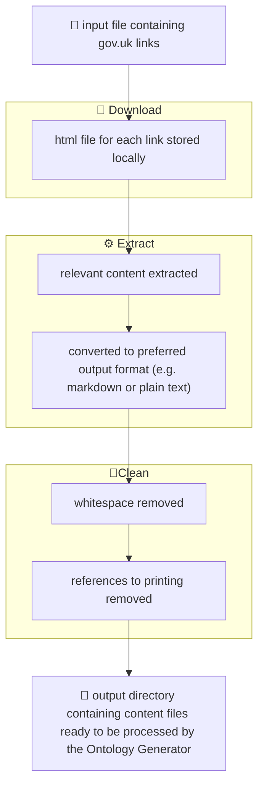

# 🛜 Ingestion Process

## Description

The ingestion steps are a set of scripts that can be run locally to gather gov.uk content based on a set of gov.uk links



## Architecture

The system uses an **API-First** approach:
1. **Endpoint**: `POST /ontology/ingest`
2. **Configuration**: Managed by the `IngestionConfig` dataclass in `scripts/ingestion/commands/utils.py`.
3. **Background Processing**: Orchestrated by `ingestion_pipeline.py` using a Python thread executor.

### Key Features
- **Cloud Support**: Uses `fsspec` for transparent access to S3 or local files.
- **Stage & Move Logs**: Logs are staged in `/tmp/` during processing and atomically moved to the final `log_path` (S3 or local) upon completion.
- **Timestamped Auditing**: Every run automatically generates a unique log file: `ingestion_YYYYMMDD_HHMMSS.log`.

## Configuration Options

The pipeline is configured via a JSON payload or a `.ini` file:

- **output_dir**: Target directory for cleaned content (S3 or local).
- **html_dir**: Intermediate directory for raw HTML.
- **protocol**: `s3` or `local`.
- **output_format**: `markdown` (default), `html`, or `text`.
- **log_path**: Path for final consolidated logs.
- **links**: A list of URLs or a path to a `links.txt` file.

## Running the Ingestion

### via API (Recommended)
Submit a `POST` request to `http://localhost:3000/ontology/ingest` with a JSON payload:

```json
{
  "config_content": {
    "output_dir": "s3://your-bucket/output",
    "protocol": "s3",
    "html_dir": "s3://your-bucket/html-content",
    "log_path": "s3://your-bucket/logs/ingest.log"
  },
  "links": ["https://www.gov.uk/guidance/your-link"]
}
```

### Running the Ingestion Process

The steps can be run from the project root:

```bash
python -m scripts.ingestion.ingestion all 
```

### Steps

The ingestion process is made up of steps which can be run separately:

#### 🪏 Download

The "download" step will go through each link in the links file and save the response as a html file.

```bash
python -m scripts.ingestion.ingestion download 
```

#### ⚙️ Extract

The "extract" step will extract the relevant text content from the html files.

```bash
python -m scripts.ingestion.ingestion extract 
```

#### 🛀 Clean

The "clean" step will clean the data (trimming whitespace and removing print references).

```bash
python -m scripts.ingestion.ingestion clean 
```

#### All 

Runs each step in order:

```bash
python -m scripts.ingestion.ingestion all 
```
